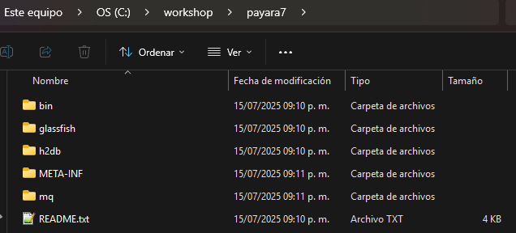

# Jakarta 11 with Payara 7 WorkShop

## Participant

### **Module 1: Set up environment.**

To start the workshop and complete each of the tasks, we need to have the following software installed on the environment. Most of this software is available for the following OS: Windows, Linux and macOS. For the Workshop, we assume that you know how to use your environment to install software and that is not necessary to review each program installation. Please install the following software:

1. Java 21
2. Maven (lastest version)
3. IDE (optional)
4. Payara 7
5. H2 Database
6. cURL (latest version)

## Java SE 21

Currently on the market, there are several versions of the Java SDK apart from the official version made by Oracle. We can choose any other distribution of the SDK made by any other provider. Those versions came from the OpenJDK initiative, and we can use for our development. Examples for this are the following: Eclipse Temurin, Azul JDK, Amazon Correto, etc.

For this Workshop I will use Azul JDK that you can download from the following page: [Azul JDK](https://www.azul.com/downloads/?package=jdk#zulu)

For Jakarta 11 libraries, we can use JDK 17 or upward. For the Workshop, we are going to use JDK 21 LTS.

## Maven

Most of the examples of code were built using maven, and as you know, this is one of the tools more common used to build java enterprise applications and for dependency management. If you need to install here is the official site to get the latest version: [Maven](https://maven.apache.org/download.cgi).

## IDE 

On the market, we have multiple choices of IDE to develop our applications. It is not mandatory to use any of the popular IDE's in the market, you can select any of them, but it is your responsibility to use the tool correctly to advance with the topics of the Workshop.

## Payara 7

Payara Server is a developer-friendly, open-source application server that offers a robust platform for building and deploying enterprise Java applications. It's designed to simplify and speed up the development, deployment, and management of Java-based web applications. Payara offers several features and advantages that make it a popular choice among developers and enterprises.

For the Workshop we are going to use Payara 7 alpha release that is the version that supports Jakarta 11. You can download the alpha version from the following site: [Payara Community](https://www.payara.fish/downloads/payara-platform-community-edition/)

Choose the full version of the server and download, then decompress on an available folder from your environment. You can see on the following image an example of the decompressed folder:



Now we can try to run the server. To make this, we need to go to the bin folder using a terminal, locate the bin folder and try to run the following command: 

```console
asadmin start-domain
```
Review the result from the same terminal window.


---
**NOTE**
You can add the options -v to enable the verbose mode to see the logs from the Payara Server, and if you want to debug, you
need to use the option -d to enable port 9090 to attach the debugger.
---

After starting the Payara Server, we can go to the admin console to review the Server up and running. To do that, open
a new tab from your browser and put the following URL: localhost:4848


To stop the Payara Server, execute the following command:

```console
asadmin stop-domain
```

---
**NOTE**
If you use the -v option, you need to open a new terminal to execute the previous command
---

## H2 Database

H2 Database is a Java-based Database that can be used as an embedded database and demostrate great performance compared with Derby Database. That is why Payara Server uses as the default Database in replacement of the old Derby database. Now all versions of Payara Server use this database for internal management, and also we can use that service for our own development.

The following steps will demostrate how to use within the server and how we can monitor and see the results of our development. If you need more information about H2 Database, you can go to the official site here: [H2 Database](https://www.h2database.com/html/main.html)

To start the H2 Database, you can execute the following command:

```console
asadmin start-database
```

To stop the H2 Database, you can use the following command:

```console
asadmin stop-database
```

If you need to open the administration console, you need to go to the default folder of the installation within the server something like: <Payara7_Home>/h2db/bin

Then you need to execute the following command

```console
java -jar h2.jar
```

After this, your default browser will open the administrative console on a new tab like this:


To connect you don't need to connect with password as the default database never set a password from the default configuration. When connect you will see the default Database test


For this Workshop, we can do a connection from our IDE if we need to get access to the resulting tables from our entities configuration for our application. We can do that with the following steps:

1. Get H2 Driver and install on your local environment (If you are using an IDE, most of the actual IDE came with some drivers you can check if the H2 Driver is available for your IDE if not get from it)
2. Create a data source connection using the following URL:
```h2
jdbc:h2:<Payara_Home>/glassfish/domains/domain1/lib/databases/embedded_default;AUTO_SERVER=TRUE
```
With the previous we are saying that we want to use the default embedded database from our domain1

As an example using IntelliJ IDEA I have the following configuration page for the Data Source:


Then I can connect to see tables:


## cURL

cURL is a useful tool to make transfer data to and from Internet Servers. When starting with our section to provide RestFul services,
we will use this tool to make client rest request calls. To install, you can follow the instructions here: [Curl Download](https://curl.se/download.html)


