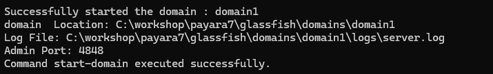
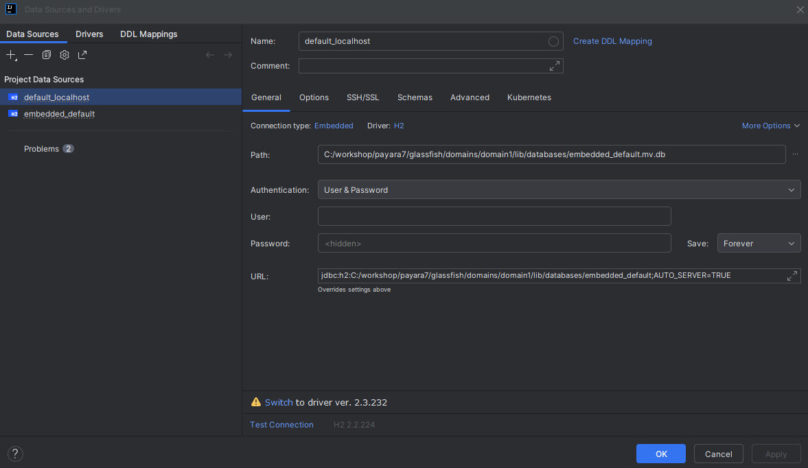
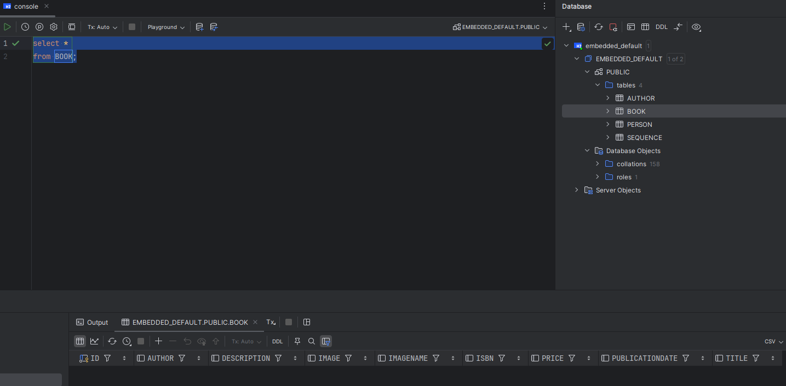

# Jakarta 11 with Payara 7 WorkShop

## Participante

### **Módulo 1: Configuración del entorno.**

Para iniciar el taller y completar cada una de las tareas, necesitamos tener el siguiente software instalado en el entorno. La mayoría de este software está disponible para los sistemas operativos Windows, Linux y macOS. Para el Taller, asumimos que sabes cómo usar tu entorno para instalar software y que no es necesario revisar cada instalación de programa. Por favor, instala el siguiente software:

1.  Java 21
2.  Maven (última versión)
3.  IDE (opcional)
4.  Payara 7
5.  Base de Datos H2
6.  cURL (última versión)

-----

## Java SE 21

Actualmente en el mercado, existen varias versiones del SDK de Java además de la versión oficial de Oracle. Podemos elegir cualquier otra distribución del SDK de cualquier otro proveedor. Esas versiones provienen de la iniciativa OpenJDK y podemos usarlas para nuestro desarrollo. Ejemplos de esto son: Eclipse Temurin, Azul JDK, Amazon Corretto, etc.

Para este Taller, usaré Azul JDK, que puedes descargar desde la siguiente página: **[Azul JDK](https://www.azul.com/downloads/?package=jdk#zulu)**

Para las librerías de Jakarta 11, podemos usar JDK 17 o superior. Para el Taller, vamos a usar **JDK 21 LTS**.

-----

## Maven

La mayoría de los ejemplos de código se construyeron usando Maven, y como sabes, esta es una de las herramientas más comunes para construir aplicaciones Java empresariales y para la gestión de dependencias. Si necesitas instalarlo, aquí está el sitio oficial para obtener la última versión: **[Maven](https://maven.apache.org/download.cgi)**.

-----

## IDE

En el mercado, tenemos múltiples opciones de IDE para desarrollar nuestras aplicaciones. No es obligatorio usar ninguno de los IDE populares, puedes seleccionar cualquiera de ellos, pero es tu responsabilidad usar la herramienta correctamente para avanzar con los temas del Taller.

-----

## Payara 7

Payara Server es un servidor de aplicaciones de código abierto amigable para desarrolladores que ofrece una plataforma robusta para construir y desplegar aplicaciones Java empresariales. Está diseñado para simplificar y acelerar el desarrollo, despliegue y gestión de aplicaciones web basadas en Java. Payara ofrece varias características y ventajas que lo convierten en una opción popular entre desarrolladores y empresas.

Para el Taller, vamos a usar la versión alfa de Payara 7, que es la versión que soporta Jakarta 11. Puedes descargar la versión alfa desde el siguiente sitio: **[Payara Community](https://www.payara.fish/downloads/payara-platform-community-edition/)**

Elige la versión completa del servidor y descárgala, luego descomprímela en una carpeta disponible en tu entorno. Puedes ver en la siguiente imagen un ejemplo de la carpeta descomprimida:


Ahora podemos intentar ejecutar el servidor. Para esto, necesitamos ir a la carpeta **bin** usando una terminal, localizar la carpeta **bin** e intentar ejecutar el siguiente comando:

```console
asadmin start-domain
```

Revisa el resultado en la misma ventana de la terminal.



---
**NOTE** 
Puedes añadir las opciones **-v** para habilitar el modo verboso y ver los logs del Payara Server, y si quieres depurar, necesitas usar la opción **-d** para habilitar el puerto 9090 y adjuntar el depurador.
----

Después de iniciar el Payara Server, podemos ir a la consola de administración para revisar que el servidor esté funcionando. Para hacerlo, abre una nueva pestaña en tu navegador y coloca la siguiente URL: **localhost:4848**


Para detener el Payara Server, ejecuta el siguiente comando:

```console
asadmin stop-domain
```

---
**NOTE** 
Si usas la opción **-v**, necesitas abrir una nueva terminal para ejecutar el comando anterior.
---

## Base de Datos H2

H2 Database es una Base de Datos basada en Java que puede usarse como base de datos embebida y demuestra un gran rendimiento en comparación con Derby Database. Por eso Payara Server la usa como base de datos predeterminada en reemplazo de la antigua base de datos Derby. Ahora todas las versiones de Payara Server usan esta base de datos para la gestión interna, y también podemos usar ese servicio para nuestro propio desarrollo.

Los siguientes pasos demostrarán cómo usarla dentro del servidor y cómo podemos monitorear y ver los resultados de nuestro desarrollo. Si necesitas más información sobre H2 Database, puedes ir al sitio oficial aquí: **[H2 Database](https://www.h2database.com/html/main.html)**

Para iniciar la Base de Datos H2, puedes ejecutar el siguiente comando:

```console
asadmin start-database
```

Para detener la Base de Datos H2, puedes usar el siguiente comando:

```console
asadmin stop-database
```

Si necesitas abrir la consola de administración, debes ir a la carpeta predeterminada de la instalación dentro del servidor, algo como: `<Payara7_Home>/h2db/bin`

Luego, debes ejecutar el siguiente comando:

```console
java -jar h2.jar
```

Después de esto, tu navegador predeterminado abrirá la consola administrativa en una nueva pestaña como esta:


Para conectarte, no necesitas usar contraseña, ya que la base de datos predeterminada nunca establece una contraseña desde la configuración predeterminada. Al conectar, verás la base de datos de prueba predeterminada.


Para este Taller, podemos hacer una conexión desde nuestro IDE si necesitamos acceder a las tablas resultantes de la configuración de nuestras entidades para nuestra aplicación. Podemos hacer esto con los siguientes pasos:

1.  Obtener el Driver de H2 e instalarlo en tu entorno local (Si estás usando un IDE, la mayoría de los IDE actuales vienen con algunos drivers; puedes verificar si el Driver de H2 está disponible para tu IDE; si no, obténlo).
2.  Crear una conexión de fuente de datos usando la siguiente URL:
    ```h2
    jdbc:h2:<Payara_Home>/glassfish/domains/domain1/lib/databases/embedded_default;AUTO_SERVER=TRUE
    ```
    Con lo anterior, estamos diciendo que queremos usar la base de datos embebida predeterminada de nuestro `domain1`.

Como ejemplo, usando IntelliJ IDEA, tengo la siguiente página de configuración para la Fuente de Datos:



Luego puedo conectarme para ver las tablas:



-----

## cURL

cURL es una herramienta útil para transferir datos hacia y desde servidores de Internet. Al comenzar nuestra sección para proporcionar servicios RestFul, usaremos esta herramienta para realizar llamadas de solicitud REST del cliente. Para instalarlo, puedes seguir las instrucciones aquí: **[Curl Download](https://curl.se/download.html)**

-----