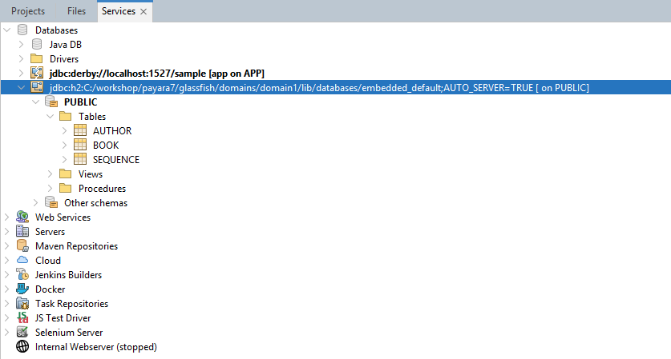

# Jakarta 11 with Payara 7 WorkShop

## Participante

### **Módulo 2: Empezando con la aplicación de catálogo de libros.**

#### Uso de Jakarta Starter

Vamos a empezar a crear nuestra aplicación base usando el **Jakarta EE starter**. Esta es una herramienta proporcionada por la comunidad para configurar y crear tu aplicación base para diferentes versiones de Jakarta EE. En este caso, necesitamos crear una aplicación base para nuestro catálogo de libros. Ve al siguiente enlace y genere la aplicación usando un `artifact id` relacionado con un catálogo o tienda de libros. Aquí está el enlace de Jakarta Starter: **[Jakarta Starter](https://start.jakarta.ee/)**


-----
**NOTA:**

En este momento, solo el tiempo de ejecución de Open Liberty está disponible para la configuración de inicio de Jakarta 11. Para el Taller, deberíamos seleccionar las siguientes opciones:

- Versión de Jakarta EE: Jakarta EE 11
- Perfil de Jakarta EE: Core Profile
- Versión de Jakarta SE: Java SE 21
- Runtime: None
- Soporte Docker: No
- Grupo/Artefacto: usa un nombre relacionado con un catálogo de libros o una librería

-----

Después de eso, puedes descomprimirlo en cualquier ubicación de tu entorno local. Aquí tienes un ejemplo de la estructura de las carpetas:


Puedes abrirlo con tu IDE preferido. En mi caso, lo abrí con IntelliJ IDEA:


Como puedes ver en los detalles de la aplicación, puedes identificar el archivo `pom.xml` que indica que esta aplicación está basada en Maven. Por eso es importante instalar los requisitos de software indicados en el primer módulo.

#### Configurando pom.xml

Para avanzar con nuestro Taller, necesitamos proporcionar la configuración correcta de nuestro archivo `pom.xml`. Puedes revisar el archivo `pom` predeterminado proporcionado por Jakarta Starter, aquí el ejemplo:


Como construiremos una aplicación web, necesitamos actualizar nuestra configuración de `pom` para indicar que vamos a usar el perfil web.

-----

#### **Tarea**

Ve al archivo `pom` y edítalo para indicar el uso del **perfil web** en lugar del perfil core para Jakarta 11: puedes ir a la siguiente página para obtener más información sobre los perfiles disponibles: **[Especificación Jakarta EE 11](https://jakarta.ee/specifications/)**

Además, otra página donde puedes encontrar una versión más reciente del perfil web es la siguiente: **[Maven Jakarta Web Profile](https://mvnrepository.com/artifact/jakarta.platform/jakarta.jakartaee-web-api)**

Después de actualizar la aplicación, compila y verifica si se muestra algún error.

-----

#### Modelar nuestra entidad

Ahora es el momento de modelar nuestra aplicación. Para esto, necesitamos usar JPA como la tecnología que nos puede ayudar a integrar nuestro modelo con bases de datos. Por definición, es bueno saber que JPA es nuestra tecnología ORM que nos permite mapear clases a tablas en una base de datos siguiendo algunas reglas para hacer esto correctamente. Se deben seguir las siguientes reglas:

- Anotar la clase con la anotación **@Entity**
- Indicar un campo como un ID con la anotación **@Id**
- Para el campo ID, recomiendo anotarlo con la anotación **@GeneratedValue** con la estrategia **GenerationType.AUTO** que permite generar ID's automáticamente, con esto no necesitamos preocuparnos por controlar su generación con una secuencia a nivel de base de datos, esto genera automáticamente la secuencia por nosotros.

-----

#### **Tarea**

Ahora es el momento de una nueva tarea. En esta tarea, tu trabajo será crear una clase basada en el siguiente modelo:


Guarda la clase de entidad en un paquete diferente al predeterminado proporcionado por la aplicación Jakarta Starter.

-----

#### Añadir configuración de persistencia

Para declarar nuestra unidad de persistencia, necesitamos definir el archivo `persistence.xml` dentro de la aplicación y ubicarlo en la carpeta: `src/main/resources/META-INF`

Te proporcionaré este archivo `persistence.xml` para que lo agregues a la aplicación. Puedes encontrarlo en la carpeta `src` de este módulo con la misma estructura para la ubicación final de tu proyecto creado con Jakarta Starter.

Observa la unidad de persistencia y verifica que estamos apuntando al siguiente nombre para el valor de `datasource`: `jdbc/__default`. Esta es la fuente de datos predeterminada utilizada en Payara Server. Vamos a usar eso para simplificar la creación de tablas.

Además de esto, necesitamos corregir todas las referencias en el archivo `persistence.xml` relacionadas con el paquete `org.eclipse.persistence.jpa`. Payara Server está utilizando EclipseLink como proveedor para JPA. Por eso necesitamos incluir esas dependencias en el archivo `pom.xml`. Aquí están las dependencias que deben incluirse en el archivo:

```xml
        <dependency>
            <groupId>org.eclipse.persistence</groupId>
            <artifactId>org.eclipse.persistence.jpa</artifactId>
            <version>5.0.0-B08</version>
        </dependency>
```

-----

#### **Tarea**

Añade la dependencia a tu `pom.xml` y verifica si el problema de referenciar el paquete `org.eclipse.persistence.jpa` está resuelto. Compila la aplicación e intenta desplegar el `.war` creado.

-----

Para las otras propiedades añadidas en el archivo `persistence.xml`, esta es una explicación de lo que hace cada una.

##### Etiquetas

- `persistence-unit`: con esta etiqueta podemos indicar el nombre de la unidad de persistencia e indicar si necesitamos gestionar transacciones con el modo JTA
- `provider`: indica la implementación del proveedor para JPA, en nuestro caso EclipseLink
- `jta-data-source`: indica el nombre de la fuente de datos a usar con el modo JTA, en nuestro caso la fuente de datos predeterminada de Payara Server.

#### Propiedades

- `eclipselink.ddl-generation`: esta propiedad indica la forma de crear tablas, en nuestro caso, usaremos el valor `drop-and-create-tables`. Para referencia, consulta el siguiente enlace: **[Generación DDL de EclipseLink](https://eclipse.dev/eclipselink/documentation/2.5/jpa/extensions/p_ddl_generation.htm)**
- `eclipselink.logging.level`: para verificar los logs de la implementación de EclipseLink, en nuestro caso INFO. Para referencia, consulta el siguiente enlace: **[Nivel de Log de EclipseLink](https://eclipse.dev/eclipselink/documentation/2.5/jpa/extensions/p_logging_level.htm)**

#### Desplegar una aplicación `.war` en Payara Server

Para desplegar una aplicación, tenemos dos formas que podemos elegir:

- Usando la consola de administración
- Usando la línea de comandos

##### Usando la consola de administración

Para desplegar usando la consola de administración, debemos ir a la siguiente URL: `localhost:4848`
Esto abrirá la consola de administración de Payara, aquí un ejemplo:


Luego, debes ir a la sección **Applications** y seleccionar la opción **deploy** para elegir el archivo `.war` que deseas desplegar en el servidor de aplicaciones. Aquí tienes un ejemplo:


Luego haz clic en la opción **OK** para proceder con el despliegue. Una vez desplegado, verás la siguiente página:


Finalmente, haz clic en la aplicación y selecciona **View Endpoints** para elegir el siguiente punto final que se proporciona desde la fuente predeterminada de la aplicación Jakarta Starter: `/jakartaee-book-store/rest/hello` o ábrelo con la URL completa desde tu navegador: `localhost:8080/jakartaee-book-store/rest/hello`


##### Usando la línea de comandos

Con la línea de comandos, necesitas usar el siguiente comando:

```console
asadmin deploy pathofyourwar/name.war
```

Espera unos segundos y luego revisa los logs en la terminal, este es un ejemplo:


El mensaje **Command deploy executed successfully** indica que la aplicación ahora está lista para usar. Abre una pestaña del navegador y ve a la siguiente URL: `localhost:8080/jakartaee-book-store/rest/hello`


-----

#### **Tarea**

Despliega tu aplicación usando uno de los dos métodos. Después, verifica si el endpoint para "hello world" está disponible.

-----

### Definir un componente de servicio para interactuar con la Entidad

Ahora tienes el modelo, y queremos ejecutar algunas inserciones para guardar nuestros primeros registros en una tabla. En este momento no tenemos ningún endpoint o servicio público para agregar nuestros datos. La forma más sencilla es insertar consultas directamente en la base de datos. Podemos hacer eso conectándonos a nuestra base de datos incrustada creada en las fuentes del Payara Server. Primero, necesitamos declarar el `entity manager` en algún componente para permitir la creación de las tablas una vez que se despliegue la aplicación, luego podremos conectarnos e insertar datos en nuestra tabla.

Te proporcionaré la consulta SQL de inserción que puedes usar para insertar algunas filas en la tabla y verificar si esas filas fueron insertadas.

Lo que necesitamos hacer es simplemente abrir la clase `HelloWorldResource` y agregar las siguientes líneas de código antes de cualquier otra declaración de métodos y volver a desplegar la aplicación:

```java
    @PersistenceContext
    private EntityManager em;
```

Con esta línea, lo que vamos a lograr es la creación automática de tablas y secuencias en la base de datos. Podemos verificar eso con nuestro cliente de BD, desde IntelliJ IDEA u otra herramienta como NetBeans. Aquí hay algunos ejemplos:




#### **Tarea**

Declara la inyección del **PersistenceContext** en la clase `HelloWorldResource`, después vuelve a desplegar la aplicación y verifica si la tabla y la secuencia están disponibles en la base de datos.

-----

Una vez que la aplicación esté disponible, desde una consola de consultas usando IntelliJ IDEA u otra herramienta, conéctate a la base de datos y ejecuta la consulta que se te proporcionó. Aquí hay algunos ejemplos:


Verifica los datos añadidos en la tabla.


-----

#### **Tarea**

Inserta las filas del archivo `insert.sql` que se te proporcionó. Usa la herramienta que prefieras para conectarte a la base de datos e insertar los datos.

-----

### Aplicación de prueba unitaria

Algo importante que debemos proporcionar a nuestra aplicación son las pruebas unitarias. Para esto, necesitamos incluir en nuestro proyecto dependencias adicionales para crear una prueba de integración para nuestra entidad. Las dependencias necesarias para la aplicación son las siguientes:

```xml
        <dependency>
            <groupId>org.junit.jupiter</groupId>
            <artifactId>junit-jupiter-api</artifactId>
            <version>5.11.0</version>
            <scope>test</scope>
        </dependency>
        <dependency>
            <groupId>org.junit.jupiter</groupId>
            <artifactId>junit-jupiter-engine</artifactId>
            <version>5.11.0</version>
            <scope>test</scope>
        </dependency>
        <dependency>
            <groupId>com.h2database</groupId>
            <artifactId>h2</artifactId>
            <version>2.2.224</version>
            <scope>test</scope>
        </dependency>
```

Vamos a usar JUnit 5 para crear nuestra prueba de integración. Para simplificar esto, compartiré contigo la prueba unitaria creada para probar la inserción de una fila en una tabla en memoria y una selección para verificar la fila creada.

Copia ese archivo BookTest.java y colócalo en el lugar correspondiente para los archivos de prueba unitaria en tu proyecto. En mi caso, se ve así:


Otra cosa que necesitamos editar es el archivo `persistence.xml` para declarar una unidad de persistencia adicional para las pruebas de integración. Edita tu archivo y agrega el siguiente contenido:

```xml
    <persistence-unit name="integration-test" transaction-type="RESOURCE_LOCAL">
        <class>putyourpackagehere.Book</class>
        <properties>
            <property name="jakarta.persistence.jdbc.url"
                      value="jdbc:h2:mem:test:sample;DB_CLOSE_ON_EXIT=FALSE;" />
            <property name="jakarta.persistence.jdbc.driver" value="org.h2.Driver" />
            <property name="jakarta.persistence.schema-generation.database.action" value="drop-and-create" />
            <property name="eclipselink.logging.level" value="FINE"/>
        </properties>
    </persistence-unit>
```

Mi archivo `persistence.xml` final se ve así:


-----
**NOTA:**

Dado que estamos añadiendo más de una unidad de persistencia en nuestra configuración, es importante actualizar todos los lugares donde se inyecta el `PersistenceContext` e indicar el nombre de la unidad de persistencia a usar, por ejemplo:

```java
    @PersistenceContext(unitName = "pu1")
    private EntityManager em;
```

Si no actualizas esto, obtendrás una excepción al desplegar nuevamente la aplicación porque el Servidor no puede determinar qué unidad de prueba usar. Por eso necesitamos indicarlo.

-----

Para ejecutar nuestra prueba, puedes usar cualquiera de los plugins disponibles para Maven en tu IDE o ejecutar el siguiente comando desde la terminal en la carpeta base de tu aplicación:

```console
mvn test
```

Verás una salida como esta:


### Introducción a los Records

Ahora es el momento de hablar sobre los **Java Records** porque definiremos un Record para gestionar un subconjunto de datos de nuestra primera entidad. La idea de esto es ver el Record como un DTO en los casos en que no necesites la información completa de la entidad.

##### ¿Qué es un Record?

Un Record es una forma simplificada de crear un objeto inmutable y elimina la necesidad de definir código repetitivo (boilerplate). Un Record proporciona una implementación predeterminada para métodos comunes heredados de `Object` como: `toString()`, `hashCode()` y `equals()`. Para definir un Record, necesitamos usar la siguiente estructura:

```java
record NombreDelRecord(TipoDeCampo nombreDeCampo, TipoDeCampo2 nombreDeCampo2, ...){}
```

El `TipoDeCampo` puede ser cualquier tipo disponible usado en Java; también puedes usar cualquiera de los modificadores para la clase, como `public`, `private` o `protected`.

Recuerda que un Record es un objeto **inmutable**, lo que significa que una vez que lo creas, no puedes cambiarlo. Por eso es un candidato para ser un envoltorio para los datos que leemos de la base de datos; una vez que leemos y establecemos el objeto, no podemos cambiarlo. Por ejemplo, un caso de uso puede ser proporcionar los datos a la vista para presentar esa información de alguna manera.

Si deseas obtener más información sobre los Records, consulta el siguiente enlace: **[Java Records](https://docs.oracle.com/en/java/javase/17/language/records.html)**

Revisa la entidad actual para `Book`:


De esta definición, probablemente podamos definir un DTO para obtener un subconjunto de la información con algún propósito.

### Especificaciones que soportan Records

Aquí está la lista de otras especificaciones que ahora soportan Records:

- Jakarta JPA
- Jakarta Validation
- Jakarta Expression Language

### Definir un record para obtener datos de nuestro repositorio

-----

#### **Tarea**

Ahora necesitamos un Record para definir un subconjunto de información de nuestra entidad `Book` y añadirle una Prueba Unitaria. Define un Record llamado **BookDTO** con los siguientes campos: `Long id`, `String title`, `String author`, `String description`, `String imageName`, `double price`.

Añade el siguiente código con un nuevo método de prueba unitaria para ver si los datos se devuelven como se espera:

```java
    @Test
    void testInsertAndSelectRecord() throws Exception {
        EntityManager entityManager = entityManagerFactory.createEntityManager();
        entityManager.getTransaction().begin();
        Book book = new Book();
        book.setTitle("Spring  AI in Action");
        book.setAuthor("Craig Walls");
        book.setIsbn("978-0596152657");
        book.setDescription("Generative AI tools like ChatGPT cause an immediate jaw drop for almost everyone who encounters them.");
        book.setPublicationDate(LocalDate.of(2024, 8, 1));
        book.setPrice(35.00);
        book.setImageName("imageBook1.png");
        entityManager.persist(book);
        entityManager.getTransaction().commit();

        CriteriaBuilder cb = entityManager.getCriteriaBuilder();
        CriteriaQuery<BookDTO> cq = cb.createQuery(BookDTO.class);
        Root<Book> root = cq.from(Book.class);
        cq.select(cb.construct(BookDTO.class, root.get("id"), root.get("title"),
                root.get("author"), root.get("description"), root.get("imageName"), root.get("price")));
        List<BookDTO> list = entityManager.createQuery(cq).getResultList();
        assertEquals(list.size(), 1);
        assertEquals(list.get(0).author(), "Craig Walls");
        assertEquals(list.get(0).title(), "Spring  AI in Action");
    }
```

Revisa el código e identifica las líneas que definen la estructura de la consulta usando Criteria Builder. Luego, identifica las líneas donde se define el mapeo del Record.

-----

### Definir un embeddable con Records

Un **Embeddable** en JPA puede ayudar a abstraer parte de la información de una tabla en un nuevo modelo para Clases Java. Ahora, con los Records, podemos definir el `@Embeddable` como un Record y luego indicar el embeddable dentro de la clase con la anotación `@Embedded`. Este es un ejemplo:

```java
 @Entity
public class Author {

    @Id
    @GeneratedValue(strategy = GenerationType.AUTO)
    private Long id;
    private String name;
    private int age;

    @Embedded
    private Address address;

    @OneToOne(mappedBy = "author")
    private Book book;
    
    //getters and setters
}

@Embeddable
public record Address(String street, String city, String state, String zip) {
}

```

-----

#### **Tarea**

Ahora definiremos los nuevos componentes para usar **Embeddable**. Para esto, necesitamos crear el siguiente modelo:


Para reducir el tiempo, he proporcionado los recursos para este modelo en las fuentes de este módulo. Por favor, copia el contenido de los archivos y muévelos a tu proyecto.

Para corregir cualquier problema con la prueba unitaria, también he compartido la prueba unitaria actualizada aquí:

```java
@Test
void testSelect() throws Exception {
    EntityManager entityManager = entityManagerFactory.createEntityManager();
    entityManager.getTransaction().begin();
    Book book = new Book();
    book.setTitle("Spring  AI in Action");
    book.setIsbn("978-0596152657");
    book.setDescription("Generative AI tools like ChatGPT cause an immediate jaw drop for almost everyone who encounters them.");
    book.setPublicationDate(LocalDate.of(2024, 8, 1));
    book.setPrice(35.00);
    book.setImageName("imageBook1.png");
    Author author = new Author();
    Address address = new Address("street", "city", "state", "zip");
    author.setName("Craig Walls");
    author.setBook(book);
    author.setAddress(address);
    book.setAuthor(author);
    entityManager.persist(book);
    entityManager.getTransaction().commit();
    List<Book> list = entityManager.createQuery("select b from Book b", Book.class).getResultList();
    assertEquals(list.size(), 1);
    assertEquals(list.get(0).getAuthor().getName(), author.getName() );
    assertEquals(list.get(0).getTitle(), "Spring  AI in Action");
}

@Test
void testInsertAndSelectRecord() throws Exception {
    EntityManager entityManager = entityManagerFactory.createEntityManager();
    entityManager.getTransaction().begin();
    Book book = new Book();
    book.setTitle("Spring  AI in Action");
    book.setIsbn("978-0596152657");
    book.setDescription("Generative AI tools like ChatGPT cause an immediate jaw drop for almost everyone who encounters them.");
    book.setPublicationDate(LocalDate.of(2024, 8, 1));
    book.setPrice(35.00);
    book.setImageName("imageBook1.png");
    Author author = new Author();
    Address address = new Address("street", "city", "state", "zip");
    author.setName("Craig Walls");
    author.setBook(book);
    author.setAddress(address);
    book.setAuthor(author);
    entityManager.persist(book);

    CriteriaBuilder cb = entityManager.getCriteriaBuilder();
    CriteriaQuery<BookDTO> cq = cb.createQuery(BookDTO.class);
    Root<Book> root = cq.from(Book.class);
    cq.select(cb.construct(BookDTO.class, root.get("id"), root.get("title"),
            root.get("author"), root.get("description"), root.get("imageName"), root.get("price")));
    List<BookDTO> list = entityManager.createQuery(cq).getResultList();
    entityManager.getTransaction().commit();
    assertEquals(list.size(), 1);
    assertEquals(list.get(0).author().getName(), author.getName() );
    assertEquals(list.get(0).title(), "Spring  AI in Action");
}
```

Además, necesitas actualizar tu unidad de persistencia para la prueba de integración con lo siguiente:

```xml
    <persistence-unit name="integration-test" transaction-type="RESOURCE_LOCAL">
        <class>putyourpackagehere.Book</class>
        <class>putyourpackagehere.Author</class>
        <properties>
            <property name="jakarta.persistence.jdbc.url"
                      value="jdbc:h2:mem:test:sample;DB_CLOSE_ON_EXIT=FALSE;" />
            <property name="jakarta.persistence.jdbc.driver" value="org.h2.Driver" />
            <property name="jakarta.persistence.schema-generation.database.action" value="drop-and-create" />
            <property name="eclipselink.logging.level" value="FINE"/>
        </properties>
    </persistence-unit>
```

Después de realizar todos esos cambios en tu proyecto, ejecuta el siguiente comando:

```console
mvn test
```

o

```console
mvn clean install package
```

Revisa los resultados de la prueba unitaria. Por mi parte, este es mi resultado:


-----

### Usar Bean Validation para Records

Como una mejora para Bean Validation, ahora podemos aplicar anotaciones de validación para los records de la siguiente manera:

```java
public record Address(@NotNull(message = "street must not be null") String street,
                      @NotEmpty(message = "city must not be empty") String city,
                      @NotBlank(message = "state must not be blank") String state,
                      String zip) {
}
```

Como viste, es muy simple incluir validaciones para nuestros Records, y esta es una actualización para Jakarta Bean Validation para Jakarta 11.

-----

#### **Tarea**

La siguiente tarea es el final de este módulo, y ahora necesitas agregar validaciones para la clase **Record** generada para `Address`.

Además, necesitas incluir nuevas dependencias para probar la validación de beans, por favor agrega lo siguiente a tu `pom.xml`:

```xml
<dependency>
    <groupId>org.hibernate.validator</groupId>
    <artifactId>hibernate-validator</artifactId>
    <version>8.0.1.Final</version>
</dependency>
<dependency>
    <groupId>org.glassfish.expressly</groupId>
    <artifactId>expressly</artifactId>
    <version>6.0.0</version>
</dependency>
```

En tu prueba unitaria, agrega la siguiente declaración en la parte superior de tu clase:

```java
private Validator validator = Validation.buildDefaultValidatorFactory().getValidator();
```

Luego, incluye la siguiente prueba unitaria para ver si todo funciona como se espera. Puedes editar el mensaje como necesites. En esta prueba unitaria, estoy usando los mismos mensajes definidos previamente para comparar las violaciones.

```java
 @Test
void testInsertAndSelectRecordWithValidations() throws Exception {
    EntityManager entityManager = entityManagerFactory.createEntityManager();
    entityManager.getTransaction().begin();
    Book book = new Book();
    book.setTitle("Spring  AI in Action");
    book.setIsbn("978-0596152657");
    book.setDescription("Generative AI tools like ChatGPT cause an immediate jaw drop for almost everyone who encounters them.");
    book.setPublicationDate(LocalDate.of(2024, 8, 1));
    book.setPrice(35.00);
    book.setImageName("imageBook1.png");
    Author author = new Author();
    Address address = new Address(null, "", " ", "zip");
    Set<ConstraintViolation<Address>> violations = validator.validate(address);
    author.setName("Craig Walls");
    author.setAddress(address);
    book.setAuthor(author);
    entityManager.persist(book);

    CriteriaBuilder cb = entityManager.getCriteriaBuilder();
    CriteriaQuery<BookDTO> cq = cb.createQuery(BookDTO.class);
    Root<Book> root = cq.from(Book.class);
    cq.select(cb.construct(BookDTO.class, root.get("id"), root.get("title"),
            root.get("author"), root.get("description"), root.get("imageName"), root.get("price")));
    List<BookDTO> list = entityManager.createQuery(cq).getResultList();
    entityManager.getTransaction().commit();
    assertEquals(list.size(), 1);
    assertEquals(list.get(0).author().getName(), author.getName());
    assertEquals(list.get(0).title(), "Spring  AI in Action");
    assertTrue(!violations.isEmpty());
    assertEquals(violations.size(), 3);

    Set<String> errorMessages = new HashSet<>();
    errorMessages.add("street must not be null");
    errorMessages.add("city must not be empty");
    errorMessages.add("state must not be blank");

    List<ConstraintViolation<Address>> resultList = violations.stream()
            .filter(v -> errorMessages.contains(v.getMessage())).toList();

    assertEquals(resultList.size(), 3);

}
```

Finalmente, ejecuta la aplicación para revisar los resultados. Todas las pruebas deberían pasar.

```console
mvn test
```

o

```console
mvn clean install package
```


-----

# Conclusión del Módulo 2

Hasta aquí hemos iniciado nuestra aplicación para agregar los modelos JPA para la aplicación de catálogo de libros. Vimos algunos de los beneficios de actualizar a Jakarta 11, y también vimos lo sencillo que es usarlo con Payara Server. Aquí tienes un resumen de los puntos clave revisados en este módulo:

- Jakarta JPA ahora soporta Records
- Anotaciones de Jakarta Bean Validation para Records
- Despliegue simple de aplicaciones en Payara 7
- Aplicación de pruebas unitarias

-----