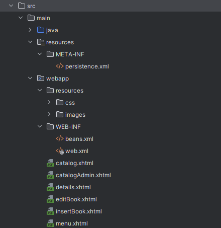
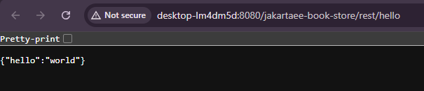
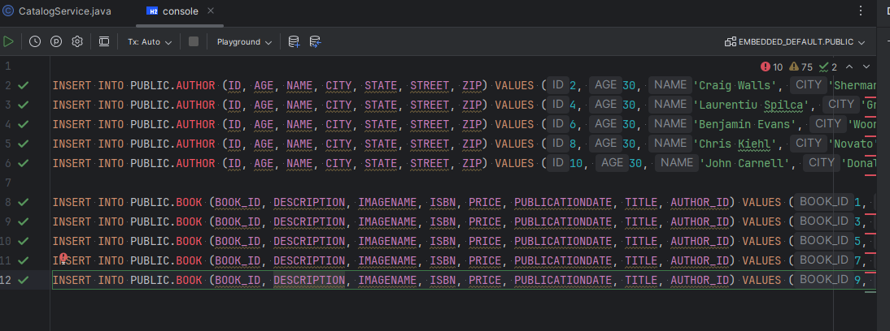
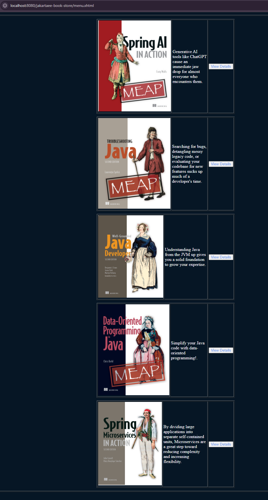
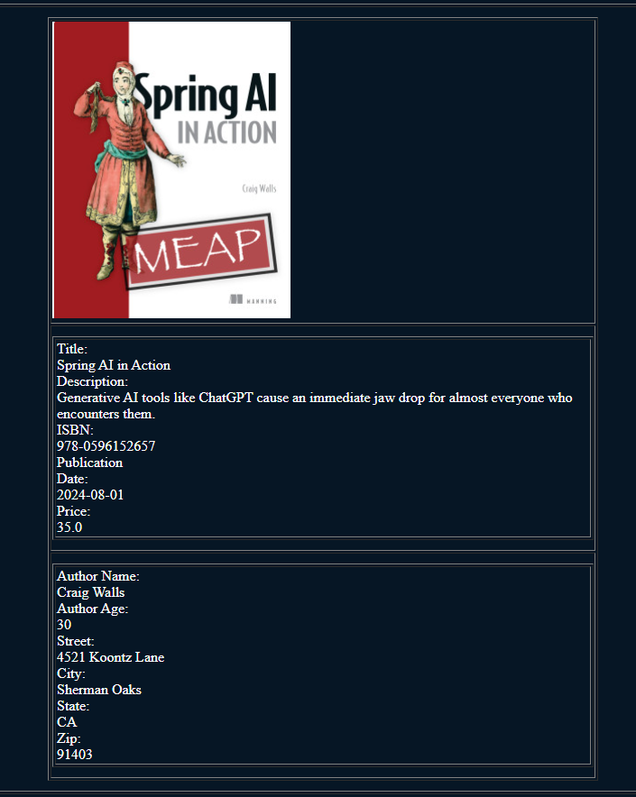
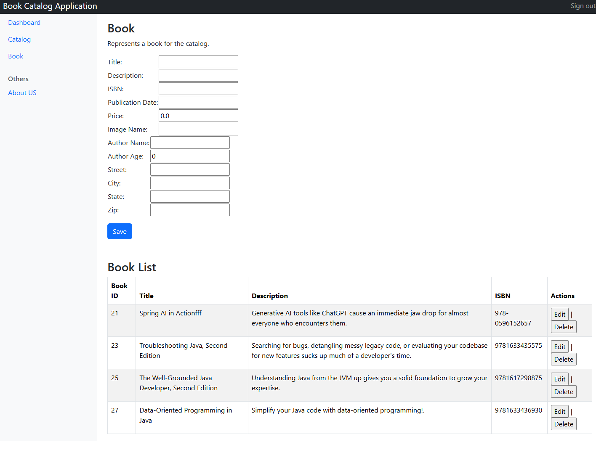

# Jakarta 11 with Payara 7 WorkShop

## Participant

### **Module 4: Add navigation view for the Book Catalog.**

Now is the time to add views for our catalog, until now we have the models we want to use to create a basic catalog application. Let's start to describe the view technologies for Jakarta EE 11. We have multiple options to create web applications on the Jakarta side, here the list of some of them:

- Jakarta Servlets (version 6.1 for Jakarta 11)
- Jakarta Pages (version 4.0 for Jakarta 11)
- Jakarta Faces (version 4.1 for Jakarta 11)
- Jakarta MVC (version 3.0, not part of Jakarta 11, stand-alone specification)

In our case, we will focus on Jakarta Faces to integrate our view to interact with our models.

#### Configure the application for Jakarta Faces

To start, we need to add the structure of folder for web application and also include some configuration files. Here is the list of files that we need to include in our application and an example of the structure of folder to have:

- web.xml (here we will configure the Faces Servlet to resolve our views and the life cycle for Faces components)



We can start to configure our application to use Jakarta Faces. To make that, we need to declare the Servlet that is going to resolve our views. You need to declare the following Servlet on your web.xml file:

```xml
<?xml version="1.0" encoding="UTF-8"?>
<web-app xmlns="http://xmlns.jcp.org/xml/ns/javaee"
         xmlns:xsi="http://www.w3.org/2001/XMLSchema-instance"
         xsi:schemaLocation="http://xmlns.jcp.org/xml/ns/javaee http://xmlns.jcp.org/xml/ns/javaee/web-app_4_0.xsd"
         version="4.0">

    <servlet>
        <servlet-name>Faces Servlet</servlet-name>
        <servlet-class>jakarta.faces.webapp.FacesServlet</servlet-class>
        <load-on-startup>1</load-on-startup>
    </servlet>
    <servlet-mapping>
        <servlet-name>Faces Servlet</servlet-name>
        <url-pattern>*.xhtml</url-pattern>
    </servlet-mapping>
</web-app>
```

-----
#### **Task**

Your task is to configure your application following previous recommendations. Start to create the folders needed for the application, then continue to copy the files to the WEB-INF folder. To simplify this, I provided those files, and you can copy from the configuration folder from this module to your WEB-INF folder for your application.

To verify all is configured well, just execute the following command:

```console
mvn clean install package
```

Deploy the application on the server to see if it is working correctly. Go to the default endpoint provided from the Jakarta Starter project to see if the application is running, here example:



-----

#### Adding resources for the application

To create the Menu page for the application, we need to include some files in the resource folder located on the WEB-INF. We need to put on this location our style file and also some images. Other important thing to include is the layout files for the structure of the page. The layout files should need to be on the folder `WEB-INF/layout`

Another important point is to include on the web.xml file the configuration to access by default the Menu page when accessing the url root from the application. To achieve that, add the following lines to your web.xml file:

```xml
    <welcome-file-list>
        <welcome-file>menu.xhtml</welcome-file>
    </welcome-file-list>
```

-----
#### **Task**

Copy the images located in the imagesWebApp folder from this module to a folder located into the resources folder from your application. Do the same for the style file located in the css folder from this module to a folder located in your resource folder. Copy also the layout files from the folder on this module named layout to folder under the WEB-INF from your application 
Finally, copy the menu.xhtml and about-us.xhtml files to the webapp folder. Build your application and deploy again.

After deploying the application, open the following URL: http://localhost:8080/jakartaee-book-store


-----

#### Add Catalog of Books

Now we have the entry point for our application. We need to provide our CDI bean to interact with the Data we have for our Book catalog and show the results on a new view for the catalog.

-----
#### **Task**

Copy the file catalog.xhtml to the webapp folder, create a service bean like the following on a package on your project. Here is the example of code for that class (you can name as you need):

```java 
@RequestScoped
@Named
public class CatalogService {

    @PersistenceContext(unitName = "pu1")
    private EntityManager em;

    private List<Book> books;

    public List<Book> getAllBooks() {
        books = em.createQuery("select b from Book b").getResultList();
        return books;
    }

}
```

Review the content of the class. Important parts to make this bean available for the application are the annotations. CDI Beans will be available for the application once the CDI runtime identifies valid annotations. Also review the injection part for the Persistence Context to interact with our entities and finally the method that is executing a select query with jpql to get all the books available on our application.

If you don't have data on your table, open module 2 and go to the sql folder, open the file inserTwoTables.sql and execute the insert queries adding first Author data and then Book data. Here example:



After doing this insert operation to the tables, please execute the following sql to move the sequence and prevent any future issues with the primary key.

```sql
    UPDATE SEQUENCE SET SEQ_COUNT = 6 where SEQ_NAME='SEQ_GEN'
```

Rebuild the application and deploy, now open the menu page and select the Catalog option:




-----

#### Integrate Catalog with Records

If you remember module 2 when we talked about the Records support. Now we can integrate the Records using the EL for Jakarta Faces. For the following task, we will create a new method on our service class to provide the data with a List of Records. Basically, the idea of the record is to use as a DTO of the data to show on some view. In this case, we don't need the full information of the book to be shown on the view.

-----
#### **Task**

Add a new method to the service bean to get the Book information with Records. Before to continue, you need to edit your BookDTO and remove the id attribute and leave the class as follows:

```java
public record BookDTO(String title, Author author, String description, String imageName, double price) {
}
```
Also, you need to update any unit tests that fail.

Here is the method to add:

```java
    public List<BookDTO> findAllBooks() {
        CriteriaBuilder cb = em.getCriteriaBuilder();
        CriteriaQuery<BookDTO> cq = cb.createQuery(BookDTO.class);
        Root<Book> root = cq.from(Book.class);
        cq.select(cb.construct(BookDTO.class, root.get("title"), 
                root.get("author"), root.get("description"), root.get("imageName"), root.get("isbn"), 
                root.get("publicationDate"), root.get("price")));
        return em.createQuery(cq).getResultList();
    }
```

Update the catalog view to call this new method, after that build and deploy the application. You will see the same result for the catalog view.


-----

#### Adding Details page for the Catalog

Now we will show a details page for the catalog to show all the information from a book. To make that you need to copy the file details.xhtml to your project and make a new couple of methods to get the full data for the page. In the following task, you will do that.

-----
#### **Task**

Create a new Record for the details page that will have most of the information, here the example:

```java
public record BookDetailsDTO(String title, Author author, String description, String imageName, String isbn, LocalDate publicationDate, double price) {
}
```
Then we need to copy the file details.xhtml to our project. Finally, add the following methods to your service bean:

```java 
    public String getBookDetails() {
        Map<String, String> params = FacesContext.getCurrentInstance().getExternalContext().getRequestParameterMap();
        BookDetailsDTO book = findBookByTitle(params.get("title"));
        FacesContext.getCurrentInstance().getExternalContext().getSessionMap().put("book", book);
        return "details";
    }
    
    public BookDetailsDTO findBookByTitle(String title) {
        TypedQuery<BookDetailsDTO> query = em.createQuery("select " +
                " new com.book.store.model.BookDetailsDTO(b.title,b.author,b.description," +
                "b.imageName, b.isbn, b.publicationDate, b.price) from Book b where b.title = :title", BookDetailsDTO.class);
        
        query.setParameter("title", title);
        return query.getSingleResult();
    }
```

For the details.xhtml edit the file and add the action to the commandButton on the page to something like the following:

```xml
    <h:commandButton value="View Details" action="#{catalogService.getBookDetails()}" style="color: cornflowerblue;">
                            <f:param name="title" value="#{b.title}"/>
    </h:commandButton>
```

Build your application, deploy and test the details page, here the example:



-----


#### Creating admin page for the Catalog
This is the last part of the module to integrate more operations for the catalog to insert, delete, and update the available information for the books on our database. Do the following task to have that functionality on your application.

-----
#### **Task**

Copy the following file to your application into the webapp folder: book.xhtml

You will need additional classes to your project that are also provided on the folders: converter, service and entity. Copy those files on a specific package on your project and then build and deploy your application, you will see more functionality to your application. Here the example:



play with the application to interact with all the functionality to edit Book entities.

As another goal, try to insert more rows on the table using the UI interface or another method like POST Rest Service. On the file bookinfo.txt you can find details of books to insert, also if you want to generate random directions, please go to the following link to get random directions from US: [Random Address Generator](https://www.fakepersongenerator.com/random-address)

To prevent an invalid status of the UI fields after updating a book from the UI interface, please copy the filter provided for you on the folder servlet. Add to your project, rebuild the application and test.

-----


