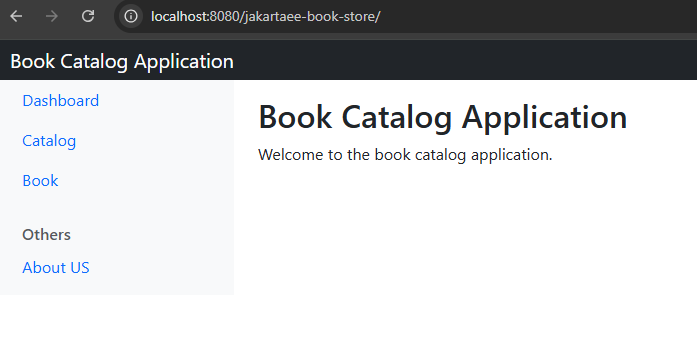
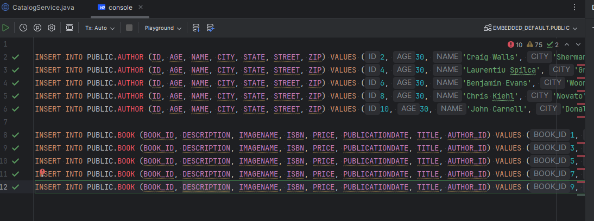
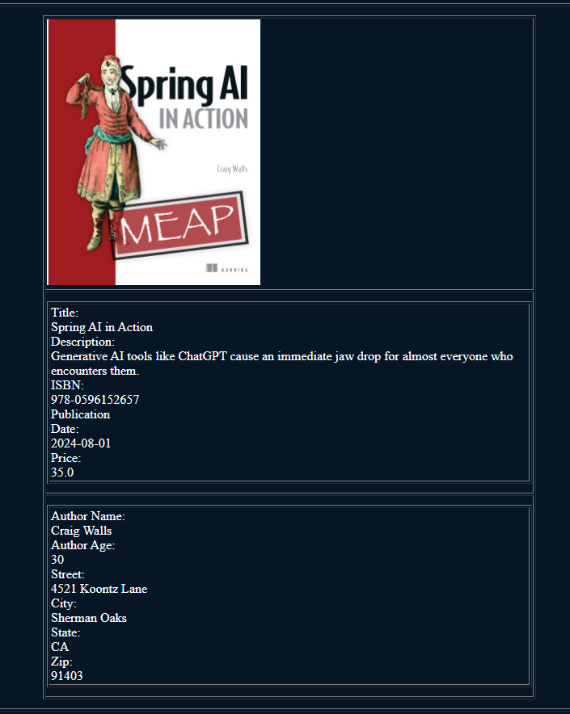

# Jakarta 11 with Payara 7 WorkShop

## Participante

### **Módulo 4: Añadir vista de navegación para el Catálogo de Libros.**

Ahora es el momento de añadir vistas para nuestro catálogo. Hasta ahora tenemos los modelos que queremos usar para crear una aplicación de catálogo básica. Comencemos a describir las tecnologías de vista para Jakarta EE 11. Tenemos múltiples opciones para crear aplicaciones web en el lado de Jakarta, aquí la lista de algunas de ellas:

- Jakarta Servlets (versión 6.1 para Jakarta 11)
- Jakarta Pages (versión 4.0 para Jakarta 11)
- Jakarta Faces (versión 4.1 para Jakarta 11)
- Jakarta MVC (versión 3.0, no forma parte de Jakarta 11, especificación independiente)

En nuestro caso, nos centraremos en **Jakarta Faces** para integrar nuestra vista y que interactúe con nuestros modelos.

#### Configurar la aplicación para Jakarta Faces

Para empezar, necesitamos añadir la estructura de carpetas para la aplicación web y también incluir algunos archivos de configuración. Aquí está la lista de archivos que necesitamos incluir en nuestra aplicación y un ejemplo de la estructura de carpetas:

- **web.xml** (aquí configuraremos el Servlet de Jakarta Faces para resolver nuestras vistas y el ciclo de vida de los componentes de Jakarta Faces)


Podemos empezar a configurar nuestra aplicación para usar Jakarta Faces. Para hacerlo, necesitamos declarar el Servlet que va a resolver nuestras vistas. Debes declarar el siguiente Servlet en tu archivo `web.xml`:

```xml
<?xml version="1.0" encoding="UTF-8"?>
<web-app xmlns="http://xmlns.jcp.org/xml/ns/javaee"
         xmlns:xsi="http://www.w3.org/2001/XMLSchema-instance"
         xsi:schemaLocation="http://xmlns.jcp.org/xml/ns/javaee http://xmlns.jcp.org/xml/ns/javaee/web-app_4_0.xsd"
         version="4.0">

    <servlet>
        <servlet-name>Faces Servlet</servlet-name>
        <servlet-class>jakarta.faces.webapp.FacesServlet</servlet-class>
        <load-on-startup>1</load-on-startup>
    </servlet>
    <servlet-mapping>
        <servlet-name>Faces Servlet</servlet-name>
        <url-pattern>*.xhtml</url-pattern>
    </servlet-mapping>
</web-app>
```

-----

#### **Tarea**

Tu tarea es configurar tu aplicación siguiendo las recomendaciones anteriores. Comienza creando las carpetas necesarias para la aplicación, luego continúa copiando los archivos a la carpeta `WEB-INF`. Para simplificar esto, te he proporcionado esos archivos, y puedes copiarlos desde la carpeta de configuración de este módulo a tu carpeta `WEB-INF` para tu aplicación.

Para verificar que todo esté bien configurado, simplemente ejecuta el siguiente comando:

```console
mvn clean install package
```

Despliega la aplicación en el servidor para ver si funciona correctamente. Ve al punto final predeterminado proporcionado por el proyecto Jakarta Starter para ver si la aplicación se está ejecutando, aquí un ejemplo:


-----

#### Añadiendo recursos para la aplicación

Para crear la página de Menú para la aplicación, necesitamos incluir algunos archivos en la carpeta de recursos ubicada en `WEB-INF`. Necesitamos poner en esta ubicación nuestro archivo de estilo y también las imágenes. Además tenemos que colocar unos archivos para colocar el layout de la aplicación. Estos archivos de layout deben colocarse en el folder `WEB-INF/layout`.

También en el archivo web.xml coloca la configuración de welcome file para que automáticamente se abra el menu de inicio si accedemos a la URL raíz de la aplicación. Para hacerlo coloca las siguientes líneas dentro del archivo web.xml

```xml
    <welcome-file-list>
        <welcome-file>menu.xhtml</welcome-file>
    </welcome-file-list>
```

-----

#### **Tarea**

Copia las imágenes ubicadas en la carpeta `imagesWebApp` de este módulo a una carpeta dentro de la carpeta `resources` de tu aplicación. Haz lo mismo para el archivo de estilo ubicado en la carpeta `css` de este módulo a una carpeta dentro de tu carpeta `resources`. Copia tambien los archivos de layout dentro de la carpet layout en el modulo a una ubicacion en tu proyecto dentro del folder WEB-INF

Finalmente, copia el archivo `menu.xhtml` y `about-us.xhtml` a la carpeta `webapp`. Construye tu aplicación y despliégala de nuevo.

Después de desplegar la aplicación, abre la siguiente URL: `http://localhost:8080/jakartaee-book-store`



-----

#### Añadir Catálogo de Libros

Ahora tenemos el punto de entrada para nuestra aplicación. Necesitamos proporcionar nuestro bean CDI para interactuar con los datos que tenemos para nuestro catálogo de libros y mostrar los resultados en una nueva vista para el catálogo.

-----

#### **Tarea**

Copia el archivo `catalog.xhtml` a la carpeta `webapp`, crea un **service bean** como el siguiente en un paquete de tu proyecto. Aquí tienes el ejemplo de código para esa clase (puedes nombrarla como necesites):

```java
@RequestScoped
@Named
public class CatalogService {

    @PersistenceContext(unitName = "pu1")
    private EntityManager em;

    private List<Book> books;

    public List<Book> getAllBooks() {
        books = em.createQuery("select b from Book b").getResultList();
        return books;
    }

}
```

Revisa el contenido de la clase. Las partes importantes para que este bean esté disponible para la aplicación son las **anotaciones**. Los beans CDI estarán disponibles para la aplicación una vez que el runtime CDI identifique las anotaciones válidas. También revisa la parte de inyección para el `Persistence Context` para interactuar con nuestras entidades y, finalmente, el método que está ejecutando una consulta select con JPQL para obtener todos los libros disponibles en nuestra aplicación.

Si no tienes datos en tu tabla, abre el **módulo 2** y ve a la carpeta `sql`, abre el archivo `inserTwoTables.sql` y ejecuta las consultas de inserción, añadiendo primero los datos del **Autor** y luego los datos del **Libro**. Aquí un ejemplo:



Reconstruye la aplicación y despliégala. Ahora abre la página de menú y selecciona la opción **Catalog**:


-----

#### Integrar el Catálogo con Records

Si recuerdas el módulo 2 cuando hablamos del soporte de Records. Ahora podemos integrar los Records usando **EL (Expression Language)** para Jakarta Faces. Para la siguiente tarea, crearemos un nuevo método en nuestra clase de servicio para proporcionar los datos con una lista de Records. Básicamente, la idea del Record es usarlo como un DTO de los datos para mostrar en alguna vista. En este caso, no necesitamos toda la información del libro para mostrarla en la vista.

-----

#### **Tarea**

Añade un nuevo método al bean de servicio para obtener la información del libro con Records. Antes de continuar, debes editar tu **BookDTO** y eliminar el atributo `id`, dejando la clase de la siguiente manera:

```java
public record BookDTO(String title, Author author, String description, String imageName, double price) {
}
```

Además, debes actualizar cualquier prueba unitaria que falle.

Aquí está el método a añadir:

```java
    public List<BookDTO> findAllBooks() {
        CriteriaBuilder cb = em.getCriteriaBuilder();
        CriteriaQuery<BookDTO> cq = cb.createQuery(BookDTO.class);
        Root<Book> root = cq.from(Book.class);
        cq.select(cb.construct(BookDTO.class, root.get("title"),
                root.get("author"), root.get("description"), root.get("imageName"), root.get("isbn"),
                root.get("publicationDate"), root.get("price")));
        return em.createQuery(cq).getResultList();
    }
```

Actualiza la vista del catálogo para llamar a este nuevo método, después construye y despliega la aplicación. Verás el mismo resultado para la vista del catálogo.


-----

#### Añadiendo página de Detalles para el Catálogo

Ahora mostraremos una página de detalles para el catálogo para mostrar toda la información de un libro. Para hacer eso, necesitas copiar el archivo `details.xhtml` a tu proyecto y crear un par de métodos nuevos para obtener los datos completos para la página. En la siguiente tarea, harás eso.

-----

#### **Tarea**

Crea un nuevo **Record** para la página de detalles que tendrá la mayor parte de la información. Aquí el ejemplo:

```java
public record BookDetailsDTO(String title, Author author, String description, String imageName, String isbn, LocalDate publicationDate, double price) {
}
```

Luego necesitamos copiar el archivo `details.xhtml` a nuestro proyecto. Finalmente, añade los siguientes métodos a tu bean de servicio:

```java
    public String getBookDetails() {
        Map<String, String> params = FacesContext.getCurrentInstance().getExternalContext().getRequestParameterMap();
        BookDetailsDTO book = findBookByTitle(params.get("title"));
        FacesContext.getCurrentInstance().getExternalContext().getSessionMap().put("book", book);
        return "details";
    }

    public BookDetailsDTO findBookByTitle(String title) {
        TypedQuery<BookDetailsDTO> query = em.createQuery("select " +
                " new com.book.store.model.BookDetailsDTO(b.title,b.author,b.description," +
                "b.imageName, b.isbn, b.publicationDate, b.price) from Book b where b.title = :title", BookDetailsDTO.class);

        query.setParameter("title", title);
        return query.getSingleResult();
    }
```

Para `details.xhtml`, edita el archivo y agrega la acción al `commandButton` en la página para que se vea algo como lo siguiente:

```xml
    <h:commandButton value="View Details" action="#{catalogService.getBookDetails()}" style="color: cornflowerblue;">
                            <f:param name="title" value="#{b.title}"/>
    </h:commandButton>
```

Construye tu aplicación, despliégala y prueba la página de detalles. Aquí tienes un ejemplo:



-----

#### Creando página de administración para el Catálogo

Esta es la última parte del módulo para integrar más operaciones para el catálogo, con el fin de insertar, eliminar y actualizar la información disponible para los libros en nuestra base de datos. Realiza la siguiente tarea para tener esa funcionalidad en tu aplicación.

-----
#### **Tarea**

Copia el siguiente archivo a tu aplicación en la carpeta `webapp`: `book.xhtml`.

Necesitarás clases adicionales para tu proyecto que también se proporcionan en las carpetas: `converter`, `service` y `entity`. Copia esos archivos en un paquete específico de tu proyecto y luego construye y despliega tu aplicación; verás más funcionalidad en tu aplicación. Aquí el ejemplo:


Desde esta interfaz se pueden realizar las operaciones de administración de la entidad Book, interactua con ella y revisa la implementación. Otro objetivo que puedes realizar es insertar más registros a la base de datos utilizando la interfaz UI que se acaba de realizar o por medio de un servicio REST utilizando método POST. Si requieres información para insertar más libros ve al archivo bookinfo.txt y observa los datos, de aquí puedes obtener para crear nuevos, si requieres generar direcciones random ve al link siguiente que es un servicio gratuito para generar direcciones random: [Random Address Generator](https://www.fakepersongenerator.com/random-address)

Para evitar un estado no válido en los campos de la interfaz de usuario tras actualizar un libro desde la interfaz, copie el filtro proporcionado en la carpeta servlet. Añádalo a su proyecto, reconstruya la aplicación y pruébela.

-----