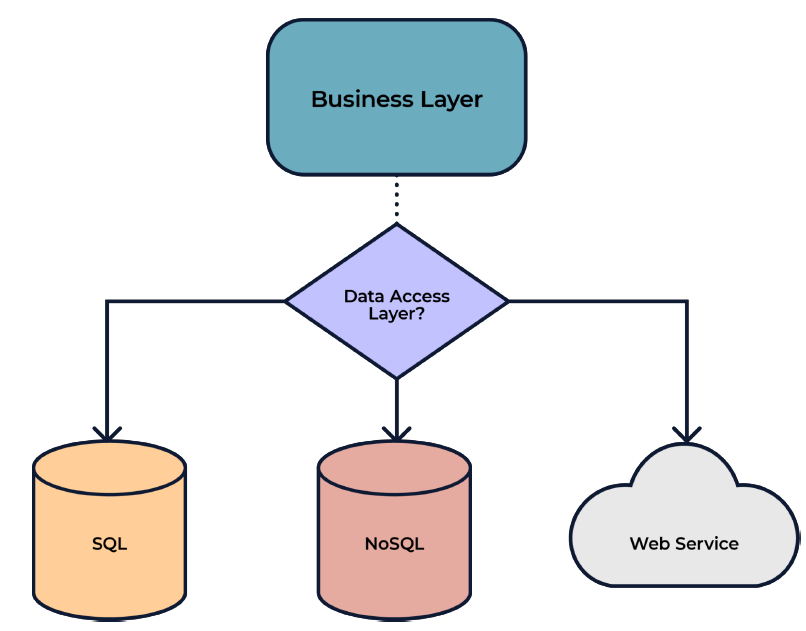

# Jakarta 11 with Payara 7 WorkShop

## Participant

### **Module 5: Use Jakarta Data to interact with entities.**

#### What is Jakarta Data?

To start, we need to define what is Jakarta Data to understand why this is now part of the Jakarta 11 specification. The aim goal for Jakarta Data is to provide a simple interface to interact with Data, by introducing the Repository pattern. This new api simplifies the access and management of the database and provides automatic query generation based on a combination of new annotations. Some of the advantages of using this new spec are the following:

- Removes complexity to interact with the data persistence.
- Introduction to a pagination mechanism for the result datasets.
- The framework provides automatic query generation based on abstractions.
- Reduced boilerplate code required to implement data access layer.
- Use of annotations to abstract functionality



Jakarta Data separates persistence and the model with the repository interface. The repositories are the classes that encapsulate the data access logic, thus decoupling the persistence mechanism from the domain model. This repository acts as a gateway for accessing persistent data of one or more entity types.

If you need more details about the Repository pattern please check the following page: [Repository Pattern](https://deviq.com/design-patterns/repository-pattern)

#### Integrate Jakarta Data 

To start with Jakarta Data, the first thing we need to have is the definition of an entity, for example, the following:

```java
@Entity
public class Employee {

    @Id
    @GeneratedValue(strategy = GenerationType.AUTO)
    private Long id;
    
    private String name;

    public void setId(Long id) {
        this.id = id;
    }

    public Long getId() {
        return id;
    }

    public String getName() {
        return name;
    }

    public void setName(String name) {
        this.name = name;
    }
}
```

Then we need to provide our Repository interface implementation, like the following:

```java
@Repository
public interface EmployeeRepository extends CrudRepository<Employee,Long> {
}
```
This is an example of using the provided CrudRepository interface that will provide (as the same suggest) CRUD operations for the entity specified on the type.

Finally, to use, we need to inject this interface on the component that requires to use it. For example, a rest endpoint, here is the code example for this:

```java
@Path("/employee")
public class EmployeeResource {

    @Inject
    private EmployeeRepository employeeRepository;

    @GET
    @Produces("application/json")
    public List<Employee> findAll() {
        return employeeRepository.findAll().toList();
    }
}
```

Other interfaces provided by the API that we can reuse are the following:

- DataRepository<T, K>: This interface is at the top of the hierarchy and does not define any method.
- BasicRepository<T, K>: This provides the most common operations for entities, like save, delete and findById.
- CrudRepository<T, K>: This interface extends BasicRepository and provides methods to make the CRUD operations for the entity like insert, update, delete and find.

It is not mandatory to use any of the previous interfaces as you can define the methods to make all the functionality by combining the different annotations from the API. An example of an implementation without those interfaces will be like the following:

```java
@Repository
public interface EmployeeRepository {
    
    @Find
    public Employee findById(int id);
    
    @Delete
    public void deleteById(int id);
    
    @Save
    public void save(Employee employee);
    
    @Update
    public void update(Employee employee);
    
    @Query("From Employee where name = :name Order By name asc")
    public Employee findByName(@Param("name") String name);
    
}
```

Here is the list of annotations and types provided by Jakarta Data:

| Annotation | Description                                                                                                                                                                                                                                                                                                                                            |
|------------|--------------------------------------------------------------------------------------------------------------------------------------------------------------------------------------------------------------------------------------------------------------------------------------------------------------------------------------------------------|
| @Find      | The Find annotation indicates that the annotated repository method executes a query to retrieve entities based on its parameters and on the arguments assigned to its parameters. The method return type identifies the entity type returned by the query.                                                                                             |
| @Save      | The Save annotation indicates that the annotated repository method accepts one or more entities and, for each entity, either adds its state to the database, or updates state already held in the database                                                                                                                                             |
| @Insert    | The Insert annotation indicates that the annotated repository method adds the state of one or more entities to the database.                                                                                                                                                                                                                           |
| @Delete    | The Delete annotation indicates that the annotated repository method deletes the state of one or more entities from the database.                                                                                                                                                                                                                      |
| @Update    | The Update annotation indicates that the annotated repository method updates the state of one or more entities already held in the database.                                                                                                                                                                                                           |
| @Query     | Annotates a repository method as a query method, specifying a query written in Jakarta Data Query Language (JDQL) or in Jakarta Persistence Query Language (JPQL).                                                                                                                                                                                     |
| @OrderBy   | Annotates a repository method to request sorting of results. When multiple OrderBy annotations are specified on a repository method, the precedence for sorting follows the order in which the OrderBy annotations are specified, and after that follows any sort criteria that are supplied dynamically by Sort parameters or by any Order parameter. |
| @By        | Annotates a parameter of a repository method, specifying a mapping to a persistent field.                                                                                                                                                                                                                                                              |
| @Param     | Annotates a parameter of a repository method to bind it to a named parameter of a Query |

Example for @Find annotation:

````java 
 @Repository
 interface Garage {
     @Find
     List<Car> getCarsWithModel(@By("model") String model);
 }
````

Example for @Save annotation:

````java
 @Repository
 interface Garage {
     @Save
     Car park(Car car);
 }
````

Example for @Insert annotation:

````java
 @Repository
 interface Garage {
     @Insert
     Car park(Car car);
 }
````

Example for @Delete annotation:

````java
 @Repository
 interface Garage {
     @Delete
     void unpark(Car car);
 }
````

Example for @Update annotation:

````java
 @Repository
 interface Garage {
     @Update
     Car update(Car car);
 }
````

Example for @Query annotation:

````java
 @Repository
 public interface People extends CrudRepository<Person, Long> {

    // JDQL with positional parameters
    @Query("where firstName = ?1 and lastName = ?2")
    List<Person> byName(String first, String last);
}
````

Example for the @OrderBy annotation:

````java
 @OrderBy("lastName")
 @OrderBy("firstName")
 @OrderBy("id")
 Person[] findByZipCode(int zipCode, PageRequest pageRequest);
````

Example for the @By annotation:

```java
 @Repository
 public interface People {

     @Find
     Person findById(@By(ID) String id); // maps to Person.ssn

     @Find
     List<Person> findNamed(@By("firstName") String first,
                            @By("lastName") String last);
     
 }
```

Example for the @Param annotation:

````java
    @Query("where firstName like :fistName order by firstName asc")
    Stream<Person> findPersonWithQueryWithErrorParamName(@Param("fistName") String firstName);
````

#### Other Characteristics from Jakarta Data

Additionally, from all the previous functionality provided by the annotations, Jakarta Data provides other functionality that can be useful to simplify implementation of applications:

| Characteristic                     | Description                                                                                                                                                                                                                     | Types                                             |
|------------------------------------|---------------------------------------------------------------------------------------------------------------------------------------------------------------------------------------------------------------------------------|---------------------------------------------------|
| Pagination offset mode             | Offset pagination is a popular method for managing and retrieving large datasets efficiently. It is based on dividing the dataset into pages containing a specified number of elements. This method allows developers to retrieve a subset of the dataset by identifying the page number and the maximum number of elements per page | Page<?>, PageRequest                              |
| Pagination cursor mode             | Cursor-based pagination aims to reduce missed and duplicate results across pages by querying relative to the observed values of entity properties that constitute the sorting criteria. | CursoredPage<?>, PageRequest, PageRequest.Cursor  |
| Dynamic query by method name | In Query by Method Name, a query is expressed via a set of method naming conventions|                                                   |

Example of Pagination offset mode:

```java
    @Query("where firstName like :firstName order by firstName asc")
    Page<Person> findPersonWithQueryAndMakePaginationFromWhere(String firstName, PageRequest pageRequest, Order<Person> sortBy);
    
    @Inject
    PersonRepository repository;        
    
    Page<Person> page = respository.findPersonWithQueryAndMakePaginationFromWhere("Alfonso", PageRequest.ofPage(1).ofSize(2), Order.by(Sort.asc("lastName")));
```

Example of Pagination cursor mode:

````java
    @Find
    CursoredPage<Person> findPersonPagWithCursorPage(@By("firstName") String name,
                                                     PageRequest pageRequest,
                                                     Order<Person> sorts);

    @Inject
    PersonRepository repository;

    Order<Person> order = Order.by(Sort.asc("age"));
    PageRequest pageRequest = PageRequest.ofSize(size);
    //pageRequest = PageRequest.afterCursor(PageRequest.Cursor.forKey(20),1,1, true);
    CursoredPage<Person> p = personPaginationRepository.findPersonPagWithCursorPage(firstName, pageRequest, order);
    pageRequest = p.previousPageRequest();
    CursoredPage<Person> before = personPaginationRepository.findPersonPagWithCursorPage(firstName, pageRequest, order);
    pageRequest = p.nextPageRequest();
    CursoredPage<Person> next = personPaginationRepository.findPersonPagWithCursorPage(firstName, pageRequest, order);
````

Example of Query by method name:

````java
@Repository
public interface CompanyRepository extends BasicRepository<Company, Long> {
    List<Company> findByAddressCity(String city);

    void deleteByName(String companyName);

    long deleteByAddress_City(String city);

    long countByAddress_City(String city);

    boolean existsByName(String name);
}
````

-----
#### **Task**

To test previous concepts now is time to experiment. Copy the files added on the folder: entity, repository and resource from this module to your project. Then check the details of the implementation and test the following endpoints:

- /rest/personas/insertPersonasRandom/{numberOfPersons}
- /rest/personas/findAll
- /rest/personas/findPersonsAndMakePaginationWithOderOfName/{page}/{size}/{attributeName}/{order}
- /rest/personas/findPersonWithQueryAndMakePagination/{firstName}/{page}/{size}/{attribute}/{order}
- /rest/personas/findPersonPagWithCursorPage/{firstName}/{size}
- /rest/personas/findPersonPagWithCursorPageSpecificCursorCustomValue/{firstName}/{size}/{age}
- rest/personas/findByFirstName/{firstName}

order can be ASC or DESC

-----


-----
#### **Task**

Now your task is to implement a repository pattern using Jakarta Data for an entity from our project. Choose the CRUD pattern and select the way todo then provide a rest endpoint to make the CRUD operations using the Repository you created.

-----

---
**NOTE:**

For this module to run the application it is needed to comment the second persistence unit declared on the persistence.xml and disable the unit test created on the previous module. Do that to prevent any issues when trying to run the application.

---
