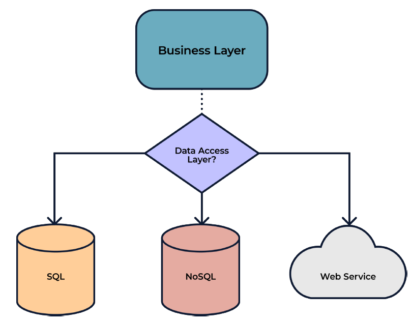

# Jakarta 11 with Payara 7 WorkShop

## Participante

### **Módulo 5: Usar Jakarta Data para interactuar con entidades.**

#### ¿Qué es Jakarta Data?

Para empezar, necesitamos definir qué es Jakarta Data para entender por qué ahora forma parte de la especificación Jakarta 11. El objetivo principal de Jakarta Data es proporcionar una interfaz sencilla para interactuar con los datos, introduciendo el patrón **Repository**. Esta nueva API simplifica el acceso y la gestión de la base de datos y proporciona generación automática de consultas basada en una combinación de nuevas anotaciones. Algunas de las ventajas de usar esta nueva especificación son las siguientes:

- Elimina la complejidad al interactuar con la persistencia de datos.
- Introduce un mecanismo de paginación para los conjuntos de resultados.
- El framework proporciona generación automática de consultas basada en abstracciones.
- Reduce el código repetitivo necesario para implementar la capa de acceso a datos.
- Utiliza anotaciones para abstraer la funcionalidad.



Jakarta Data separa la persistencia y el modelo con la interfaz del repositorio. Los repositorios son las clases que encapsulan la lógica de acceso a datos, desacoplando así el mecanismo de persistencia del modelo de dominio. Este repositorio actúa como una puerta de enlace para acceder a datos persistentes de uno o más tipos de entidades.

Si requieres mas detalles sobre lo que es el patron Repository ve al siguiente link: [Repository Pattern](https://deviq.com/design-patterns/repository-pattern)

#### Integrar Jakarta Data

Para empezar con Jakarta Data, lo primero que necesitamos tener es la definición de una entidad, por ejemplo, la siguiente:

```java
@Entity
public class Employee {

    @Id
    @GeneratedValue(strategy = GenerationType.AUTO)
    private Long id;

    private String name;

    public void setId(Long id) {
        this.id = id;
    }

    public Long getId() {
        return id;
    }

    public String getName() {
        return name;
    }

    public void setName(String name) {
        this.name = name;
    }
}
```

Luego, necesitamos proporcionar nuestra implementación de la interfaz del Repositorio, como la siguiente:

```java
@Repository
public interface EmployeeRepository extends CrudRepository<Employee,Long> {
}
```

Este es un ejemplo de cómo usar la interfaz `CrudRepository` proporcionada, que (como su nombre sugiere) ofrecerá operaciones CRUD para la entidad especificada en el tipo.

Finalmente, para usarlo, necesitamos inyectar esta interfaz en el componente que requiera usarla. Por ejemplo, un *endpoint* REST; aquí tienes el ejemplo de código para esto:

```java
@Path("/employee")
public class EmployeeResource {

    @Inject
    private EmployeeRepository employeeRepository;

    @GET
    @Produces("application/json")
    public List<Employee> findAll() {
        return employeeRepository.findAll().toList();
    }
}
```

Otras interfaces proporcionadas por la API que podemos reutilizar son las siguientes:

- `DataRepository<T, K>`: Esta interfaz se encuentra en la cima de la jerarquía y no define ningún método.
- `BasicRepository<T, K>`: Proporciona las operaciones más comunes para las entidades, como guardar, eliminar y buscar por ID.
- `CrudRepository<T, K>`: Esta interfaz extiende `BasicRepository` y proporciona métodos para realizar las operaciones CRUD para la entidad, como insertar, actualizar, eliminar y buscar.

No es obligatorio usar ninguna de las interfaces anteriores, ya que puedes definir los métodos para realizar toda la funcionalidad combinando las diferentes anotaciones de la API. Un ejemplo de una implementación sin esas interfaces sería la siguiente:

```java
@Repository
public interface EmployeeRepository {

    @Find
    public Employee findById(int id);

    @Delete
    public void deleteById(int id);

    @Save
    public void save(Employee employee);

    @Update
    public void update(Employee employee);

    @Query("From Employee where name = :name Order By name asc")
    public Employee findByName(@Param("name") String name);

}
```

Aquí está la lista de anotaciones y tipos proporcionados por Jakarta Data:

| Anotación | Descripción |
|---|---|
| @Find | La anotación Find indica que el método de repositorio anotado ejecuta una consulta para recuperar entidades basándose en sus parámetros y en los argumentos asignados a sus parámetros. El tipo de retorno del método identifica el tipo de entidad devuelto por la consulta. |
| @Save | La anotación Save indica que el método de repositorio anotado acepta una o más entidades y, para cada entidad, agrega su estado a la base de datos o actualiza el estado ya existente en la base de datos. |
| @Insert | La anotación Insert indica que el método de repositorio anotado agrega el estado de una o más entidades a la base de datos. |
| @Delete | La anotación Delete indica que el método de repositorio anotado elimina el estado de una o más entidades de la base de datos. |
| @Update | La anotación Update indica que el método de repositorio anotado actualiza el estado de una o más entidades ya existentes en la base de datos. |
| @Query | Anota un método de repositorio como un método de consulta, especificando una consulta escrita en Jakarta Data Query Language (JDQL) o en Jakarta Persistence Query Language (JPQL). |
| @OrderBy | Anota un método de repositorio para solicitar la ordenación de los resultados. Cuando se especifican múltiples anotaciones OrderBy en un método de repositorio, la precedencia para la ordenación sigue el orden en que se especifican las anotaciones OrderBy, y después de eso sigue cualquier criterio de ordenación que se suministre dinámicamente por los parámetros Sort o por cualquier parámetro Order. |
| @By | Anota un parámetro de un método de repositorio, especificando un mapeo a un campo persistente. |
| @Param | Anota un parámetro de un método de repositorio para vincularlo a un parámetro con nombre de una consulta. |

Ejemplo para la anotación @Find:

```java
 @Repository
 interface Garage {
     @Find
     List<Car> getCarsWithModel(@By("model") String model);
 }
```

Ejemplo para la anotación @Save:

```java
 @Repository
 interface Garage {
     @Save
     Car park(Car car);
 }
```

Ejemplo para la anotación @Insert:

```java
 @Repository
 interface Garage {
     @Insert
     Car park(Car car);
 }
```

Ejemplo para la anotación @Delete:

```java
 @Repository
 interface Garage {
     @Delete
     void unpark(Car car);
 }
```

Ejemplo para la anotación @Update:

```java
 @Repository
 interface Garage {
     @Update
     Car update(Car car);
 }
```

Ejemplo para la anotación @Query:

```java
 @Repository
 public interface People extends CrudRepository<Person, Long> {

    // JDQL con parámetros posicionales
    @Query("where firstName = ?1 and lastName = ?2")
    List<Person> byName(String first, String last);
}
```

Ejemplo para la anotación @OrderBy:

```java
 @OrderBy("lastName")
 @OrderBy("firstName")
 @OrderBy("id")
 Person[] findByZipCode(int zipCode);
```

Ejemplo para la anotación @By:

```java
 @Repository
 public interface People {

     @Find
     Person findById(@By(ID) String id); // se mapea a Person.ssn

     @Find
     List<Person> findNamed(@By("firstName") String first,
                            @By("lastName") String last);

 }
```

Ejemplo para la anotación @Param:

```java
    @Query("where firstName like :fistName order by firstName asc")
    Stream<Person> findPersonWithQueryWithErrorParamName(@Param("fistName") String firstName);
```

#### Otras características de Jakarta Data

Además, de toda la funcionalidad anterior proporcionada por las anotaciones, Jakarta Data ofrece otra funcionalidad que puede ser útil para simplificar la implementación de aplicaciones:

| Característica | Descripción | Tipos |
|---|---|---|
| Modo de paginación por desplazamiento (offset) | La paginación por desplazamiento es un método popular para gestionar y recuperar grandes conjuntos de datos de manera eficiente. Se basa en dividir el conjunto de datos en páginas que contienen un número específico de elementos. Este método permite a los desarrolladores recuperar un subconjunto del conjunto de datos identificando el número de página y el número máximo de elementos por página. | Page\<?\>, PageRequest |
| Modo de paginación por cursor | La paginación basada en cursor tiene como objetivo reducir los resultados perdidos y duplicados entre páginas consultando en relación con los valores observados de las propiedades de la entidad que constituyen los criterios de ordenación. | CursoredPage\<?\>, PageRequest, PageRequest.Cursor |
| Consulta dinámica por nombre de método | En Query by Method Name, una consulta se expresa a través de un conjunto de convenciones de nomenclatura de métodos. | |

Ejemplo de modo de paginación por desplazamiento:

```java
    @Query("where firstName like :firstName order by firstName asc")
    Page<Person> findPersonWithQueryAndMakePaginationFromWhere(String firstName, PageRequest pageRequest, Order<Person> sortBy);

    @Inject
    PersonRepository repository;

    Page<Person> page = respository.findPersonWithQueryAndMakePaginationFromWhere("Alfonso", PageRequest.ofPage(1).ofSize(2), Order.by(Sort.asc("lastName")));
```

Ejemplo de modo de paginación por cursor:

```java
    @Find
    CursoredPage<Person> findPersonPagWithCursorPage(@By("firstName") String name,
                                                     PageRequest pageRequest,
                                                     Order<Person> sorts);

    @Inject
    PersonRepository repository;

    Order<Person> order = Order.by(Sort.asc("age"));
    PageRequest pageRequest = PageRequest.ofSize(size);
    //pageRequest = PageRequest.afterCursor(PageRequest.Cursor.forKey(20),1,1, true);
    CursoredPage<Person> p = personPaginationRepository.findPersonPagWithCursorPage(firstName, pageRequest, order);
    pageRequest = p.previousPageRequest();
    CursoredPage<Person> before = personPaginationRepository.findPersonPagWithCursorPage(firstName, pageRequest, order);
    pageRequest = p.nextPageRequest();
    CursoredPage<Person> next = personPaginationRepository.findPersonPagWithCursorPage(firstName, pageRequest, order);
```

Ejemplo de consulta por nombre de método:

```java
@Repository
public interface CompanyRepository extends BasicRepository<Company, Long> {
    List<Company> findByAddressCity(String city);

    void deleteByName(String companyName);

    long deleteByAddress_City(String city);

    long countByAddress_City(String city);

    boolean existsByName(String name);
}
```

-----
#### **Tarea**

Para probar los conceptos que hemos visto es necesario que copies los archivos colocados en los folders: entity, repository y resource desde los archivos fuente de este módulo hacia tu proyecto. Después de copiarlos revisa la implementation y prueba los siguientes endpoints:

- /rest/personas/insertPersonasRandom/{numberOfPersons}
- /rest/personas/findAll
- /rest/personas/findPersonsAndMakePaginationWithOderOfName/{page}/{size}/{attributeName}/{order}
- /rest/personas/findPersonWithQueryAndMakePagination/{firstName}/{page}/{size}/{attribute}/{order}
- /rest/personas/findPersonPagWithCursorPage/{firstName}/{size}
- /rest/personas/findPersonPagWithCursorPageSpecificCursorCustomValue/{firstName}/{size}/{age}
- rest/personas/findByFirstName/{firstName}

order puede tener el valor ASC o DESC

-----

-----

#### **Tarea**

Ahora tu tarea es implementar un patrón de repositorio usando Jakarta Data para una entidad de nuestro proyecto. Elige el patrón CRUD y selecciona la forma de hacerlo. Al final, proporcionarás un *endpoint* REST para realizar las operaciones CRUD.

-----

---
**NOTE:**

Para que este módulo ejecute la aplicación, es necesario comentar la segunda unidad de persistencia declarada en el archivo persistence.xml y deshabilitar la prueba unitaria que se agregó en un módulo previo. Esto evitará problemas al intentar ejecutar la aplicación.

---

