# Jakarta 11 with Payara 7 WorkShop

## Participant

### **Module 6: Concurrency.**

#### Jakarta Concurrency

Jakarta Concurrency specification is part of the umbrella for the Jakarta 11 specification, and the principal focus is the development of a standard framework to managing and using concurrent programming within Enterprise Applications. This specification takes care of the challenges of multithreading in a managed environment, ensuring the concurrent operations don't compromise the integrity of the application server or container.

From that, it is not recommended to use native thread constructs because that will compromise the managed environment. That means that we can't use Java SE concurrency APIs such as java.lang.Thread or java.util.Timer directly.

The base implementation of this specification provides a managed version of the known interfaces from java.util.concurrent.ExecutorService. For that we have the following:

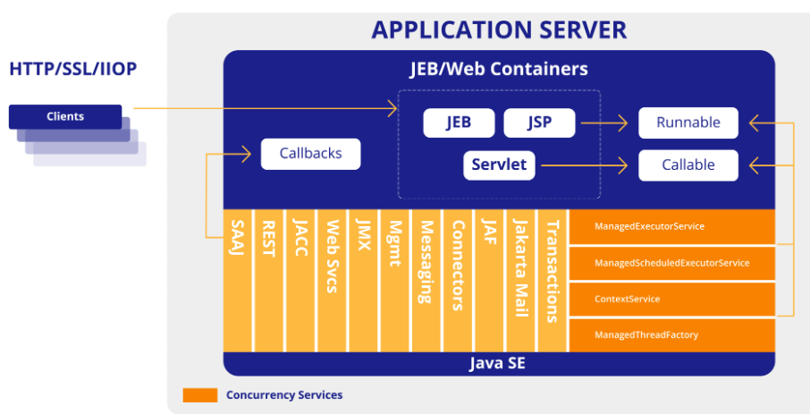

- ManagedExecutorService: Similar to java.util.concurrent.ExecutorService, it's used for submitting asynchronous tasks for execution in a managed thread pool. It's ideal for offloading long-running operations from the main request thread.
- ManagedScheduledExecutorService: Extends ManagedExecutorService for scheduling tasks to run at a specific time or repeatedly.
- ContextService: Facilitates the capture and propagation of contextual information (like security context, classloader context, CDI context) across different threads. This is vital to avoid issues when a task is executed on a different thread than the one that initiated it.
- ManagedThreadFactory: Allows the creation of threads that inherit the context of the component that created them, ensuring proper security and other contexts are propagated.

#### Benefits to use the spec

By adding the implementation of this, we are gaining a lot of benefits, some of them are the following:

- Reduced boilerplate code and complexity: With this layer of managed services now is straightforward to use and implement on our daily basis, inject the resources when you need and use on your specific components.
- Compatibility with the Java SE Concurrency: As we said this spec is on top of the Java SE implementation providing the most recent additions for Concurrency, we will see how to use Virtual Threads more later.
- Improved performance and Responsiveness: By offloading long-running tasks to background threads, applications can remain responsive to user interactions.
- Better resource utilization: Efficiently uses available CPU cores by executing multiple tasks concurrently.
- Container Integrity: Ensures that concurrent operations respect the container's environment and don't lead to resource leaks or security vulnerabilities.
- Standardization: Provides a standard, vendor-neutral way to implement concurrency in Jakarta EE applications, promoting portability.
- Support for Modern Java Features: Newer versions of Jakarta Concurrency (like 3.1 in Jakarta EE 11) are incorporating support for modern Java features like Virtual Threads, further enhancing scalability and performance.

#### How to use it?

Payara provides default resources and the ability to define new depending on the needs to review the available services for concurrency go to the following URL: [Payara Home](http://localhost:4848/common/index.jsf)

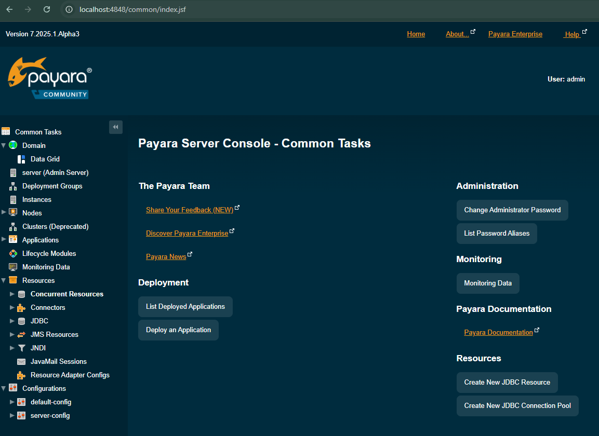

Go to the Resources section on the left side menu and select **Concurrent Resources**, expand the option and see the available options:

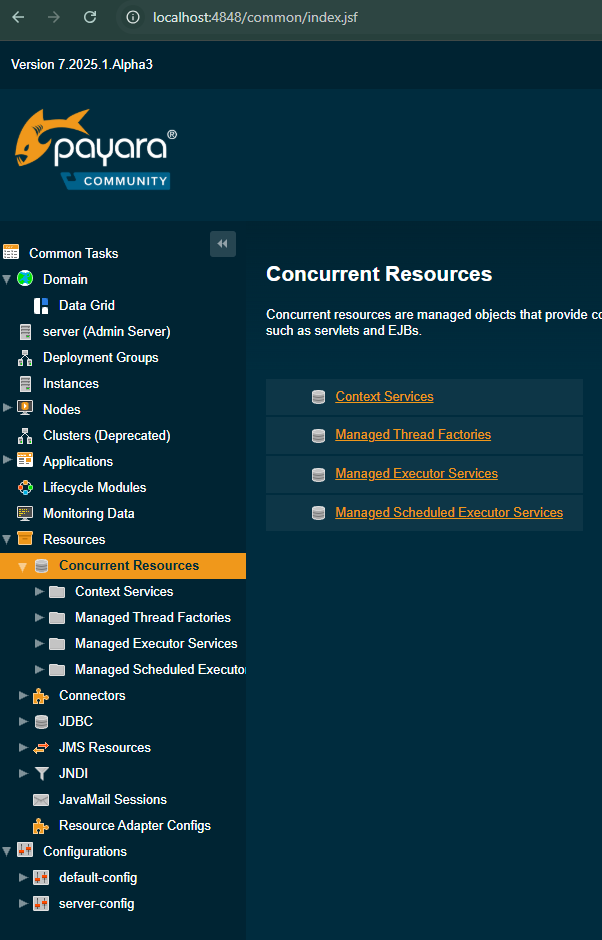

Now it is time to create a simple implementation using our concurrency managed services.

#### Use default resources

Let's start with the ManagedExecutorService. This will help us to execute tasks asynchronously, and the context of the container is propagated to the thread executing the task. To use, you need to inject the resource on your component like this:

```java
    @Resource
    private ManagedExecutorService managedExecutorService;
```

---
**NOTE:**

For Concurrency 3.1 now you can use the annotation @Inject to inject the resources

---

then we can use that executor to send the work to new threads, look at the following example:

```java
    @Inject
    private ManagedExecutorService managedExecutorService;

    @GET
    @Path("managedExecutorService")
    @Produces(MediaType.TEXT_PLAIN)
    public String getManagedExecutorService() throws ExecutionException, InterruptedException {
        AtomicInteger numberExecution1 = new AtomicInteger(0);
        AtomicInteger numberExecution2 = new AtomicInteger(0);
        Future future1 = managedExecutorService.submit(() -> {
            numberExecution1.incrementAndGet();
            System.out.println("Job running" + Thread.currentThread().getName());
        });
        
        Future future2 = managedExecutorService.submit(() -> {
            numberExecution2.incrementAndGet();
            System.out.println("Job running" + Thread.currentThread().getName());
        });
        
        future1.get();
        future2.get();
        System.out.println("Finishing jobs:" + (numberExecution1.get() +"  "+ numberExecution2.get()));
        return "Completed";
    }

```
In this example, we are creating two jobs on different threads using the ManagedExecutorService to get a new atomic number to be printed on the output.

Now we need to review the ContextService, this will help us to capture and propagate contextual information (e.g, security context, transaction context) from the thread where a task is submitted to the thread where it's executed.

In the following example, I will show you how the thread used from the ManagedExecutorService is using the contextual information
to print the JNDI resource name requested. This is automatically provided by the default ContextService provided by the server.

```java 
    @GET 
    @Path("contextService")
    @Produces(MediaType.TEXT_PLAIN)
    public String getContextService() throws ExecutionException, InterruptedException {
        Future<String> future1 = managedExecutorService.submit(() -> {
            try {
                return "getting data from context"+new InitialContext().lookup("java:comp/DefaultDataSource");
            } catch (NamingException e) {
                throw new RuntimeException(e);
            }
        });
        
        String result = future1.get();
        
        return "Completed with result " + result ;
    }
```
The Next component is the ManagedThreadFactory. This will provide the ability to create threads managed by the container. Also, the context of the container is propagated to the thread executing the task. To use, you need to inject the resource on your component like this:

```java
    @Inject 
    private ManagedThreadFactory managedThreadFactory;
```
Then we can use the ManagedThreadFactory to execute a task:

```java
    @GET
    @Path("threadFactory")
    @Produces(MediaType.TEXT_PLAIN)
    public String processWithThreadFactory() throws ExecutionException, InterruptedException {
        Thread t  = managedThreadFactory.newThread(() -> {
            System.out.println("ManagedThread executing");
        });
        
        t.start();
        return "Completed";
    }
```

And, the ManagedScheduledExecutorService. This will help us to define a task to be executed at specified and periodic times. To use, you can Inject the default resource from the server:

```java
    @Inject
    private ManagedScheduledExecutorService managedScheduledExecutorService;
```

Then we can use the ManagedScheduleExecutorService. The first example shows how to send a task at a specified time, after a delay:

```java
    @GET
    @Path("/scheduleTaskForGivenDelay")
    @Produces(MediaType.TEXT_PLAIN)
    public String processWithScheduledExecutorService() throws ExecutionException, InterruptedException {
        managedScheduledExecutorService.schedule(() -> System.out.println("ScheduledExecutor executing"), 10, TimeUnit.SECONDS);
        return "Scheduled task";
    }
    
    @GET
    @Path("/scheduleTaskForPeriodicTime")
    @Produces(MediaType.TEXT_PLAIN)
    public String scheduleServiceAllTheTime() throws ExecutionException, InterruptedException {
        managedScheduledExecutorService.scheduleAtFixedRate(() -> System.out.println("ScheduledExecutor with rate"), 3, 1, TimeUnit.SECONDS);
        managedScheduledExecutorService.scheduleWithFixedDelay(() -> System.out.println("ScheduledExecutor with delay"), 2, 2, TimeUnit.SECONDS);
        return "Scheduled task";
    }
```

The previous two examples show how you can create a task to start at a specified time, and the second endpoint shows how you can execute a task for a periodic time. The method scheduleAtFixedRate submits a periodic action that becomes enabled first after the given initial delay, and subsequently with the given period; that is, executions will begin after initialDelay, then initialDelay + period, then initialDelay + 2 * period, and so on. The method scheduleWithFixedDelay submits a periodic action that becomes enabled first after the given initial delay, and subsequently with the given delay between the termination of one execution and the commencement of the next.

Other implementations that we need to mention are the ForkAnJoinPool and the CronTrigger configuration. First, start with CronTrigger as the name suggests this is used to configure the cron notation on a class to be used as a configuration to execute periodic tasks. With the following example, you will see how to use it. If you want to see the reference of the API to understand the details for the cron notation, review the following page: [CronTrigger API](https://jakarta.ee/specifications/concurrency/3.1/apidocs/jakarta.concurrency/jakarta/enterprise/concurrent/crontrigger)

To use this CronTrigger configuration you need to combine with the ManagedScheduleExecutorService, here the example:

```java
    @Inject
    ManagedScheduledExecutorService managedScheduledExecutorService;
```

Then you can use the Trigger interface to save the reference of the CronTrigger object to be used with the ManagedScheduleExecutorService on the method schedule. Here the example:

```java
    @GET
    @Path("cronTrigger")
    @Produces(MediaType.TEXT_PLAIN)
    public String getText() throws InterruptedException {
        AtomicInteger numberExecution = new AtomicInteger();
        ZoneId santDomingo = ZoneId.of("America/America/Santo_Domingo");
        Trigger trigger = new CronTrigger("* * * * * *", santDomingo);
        ScheduledFuture feature = managedScheduledExecutorService.schedule(() -> {
            numberExecution.getAndIncrement();
            System.out.println("Cron Trigger running");
        }, trigger);
        Thread.sleep(10000);
        feature.cancel(true);
        return "CronTrigger Submitted:"+numberExecution.get();
    }
```

From the previous example, we can see that we configured a CronTrigger to be executed every second and the task will use the trigger as the configuration. The task will increment a number and will print a message. Then we controlled the execution with a delay of 10,000 milliseconds to permit the task work and print and increment the number 10 times. When finished, we can get the number incremented with value of 10.

Now is the time for the ForkAndJoinPool implementation. The ForkAndJoinPool is useful when you have a task that needs to process a bunch of data, and you want to divide the work (divide and conquer) in atomic units to be processed with the number of available processors from your environment. This implies to make parallel work and at some moment join all the results. For this, you need to implementa a ForkJoinTask of the type RecursiveAction without returning results or RecursiveTask to return results. In the following example, you will see how to use.

We need to use the ManagedThreadFactory to provide to the ForkJoinPool the source of the threads to be used by the implementation:

```java
    @Inject
    ManagedThreadFactory managedThreadFactory;
```
Then we can declare the endpoint to call the ForkJoinPool, as following:

```java
    @GET
    @Path("forkjoin")
    @Produces(MediaType.TEXT_PLAIN)
    public String forkJoinWorkerThreadExecution() throws InterruptedException, ExecutionException {
        final long[] numbers = LongStream.rangeClosed(1, 1_000_000).toArray();
        ForkJoinPool pool = new ForkJoinPool(Runtime.getRuntime().availableProcessors(), managedThreadFactory, null, false);
        ForkJoinTask<Long> task = new ForkJoinSum(numbers);
        ForkJoinTask<Long> total = pool.submit(task);
        Long t = total.get();
        String message = String.format("Counting numbers total:%d", t);
        pool.shutdown();
        return message;
    }
```

We need the ForkJoinSum implementation, here is the code:

```java
    class ForkJoinSum  extends RecursiveTask<Long> {

        public static final long THRESHOLD = 10_000;

        private final long[] numbers;
        private final int start;
        private final int end;

        public ForkJoinSum(long[] numbers) {
            this(numbers, 0, numbers.length);
        }

        private ForkJoinSum(long[] numbers, int start, int end) {
            this.numbers = numbers;
            this.start = start;
            this.end = end;
        }

        @Override
        protected Long compute() {
            System.out.println("thread name:"+Thread.currentThread().getName());
            int length = end - start;
            if (length <= THRESHOLD) {
                return computeSequentially();
            }
            ForkJoinSum leftTask = new ForkJoinSum(numbers, start, start + length / 2);
            leftTask.fork();
            ForkJoinSum rightTask = new ForkJoinSum(numbers, start + length / 2, end);
            Long rightResult = rightTask.compute();
            Long leftResult = leftTask.join();
            return leftResult + rightResult;
        }

        private long computeSequentially() {
            long sum = 0;
            for (int i = start; i < end; i++) {
                sum += numbers[i];
            }
            return sum;
        }
    }
```

From the example, we see that was created an array of one million of long numbers added sequentially. Then it is created the ForkJoinPool using the available processors from the system, our ManagedThreadFactory instance and another two values indicated as null and false. Then we need to use our implementation class for the RecursiveTask that is going to return the results after finishing. Finally, we start the execution by calling the method submit from the pool created. To get the results, we call the method get to wait until all the execution finish, after that it is printed on the screen the result.

Continue with new additions for Jakarta Concurrency 3.1, now we have the annotation @Schedule that can execute in combination with the @Asynchronous annotation a task for a specified schedule time using cron notation or with custom properties for time. You can indicate this on a method from a bean. Then you can inject and start execution at the moment you desire. The following is the example of the class with the method for a Schedule configuration:

```java
    @RequestScoped
    public class ScheduledTask {

    @Inject
    private ManagedScheduledExecutorService scheduledExecutorService;

    @Asynchronous(runAt = {
            @Schedule(cron = "*/3 * * * * *")
    })
    public void scheduledTask() {
        System.out.println("Scheduled Task");
    }
}
```

Then you need to inject the bean in the component you need, where the execution of the task will start.

```java
    @Inject
    private ScheduledTask scheduledTask;
    
    @GET
    @Path("asynchronous")
    @Produces(MediaType.TEXT_PLAIN)
    public String getAsynchronousWorkerThreadExecution() throws InterruptedException, ExecutionException {
        scheduledTask.scheduledTask();
        return "asynchronous";
    }
```

Here we are starting the execution of the schedule task when calling the method sheduledTask().

The last topic from this section is the addition of a custom way to integrate the contextual information named Contextual Flows (Reactive Streams); 
with this, the idea is to enable a way to use the contextual information in the context of reactive implementations. While creating a full example of this topic will imply a lot of effort. For now, we just show in the following code how we can achieve that with the current API:

```java
@ApplicationScoped
public class ReactiveService {

    @Inject
    private ContextService contextService;

    public Flow.Subscriber<String> createContextualSubscriber(Flow.Subscriber<String> delegate) {       
        return contextService.contextualSubscriber(delegate);
    }
}
```

-----
#### **Task**

With all of this information now is your turn to experiment. That is why your job for now is to copy each of the examples described here and use in your own implementation. Remember that the last topic is showing a partial implementation of how the Contextual Flows can work, and that is why it is not enough to run reactive streams on this example.

-----

#### Define your custom resource

With Payara, you can create your custom resources by using Admin Console, Admin commands or with annotations. In the following examples, you will see how to do that within Payara Server.

##### Context Service

You can add a custom resource using Admin Console, Admin commands or by annotation. If you want to add the custom resource for ContextService then you need to go to option Menu ***Resources -> Concurrent Resources -> Context Service*** on the left side of the Payara Server Home:

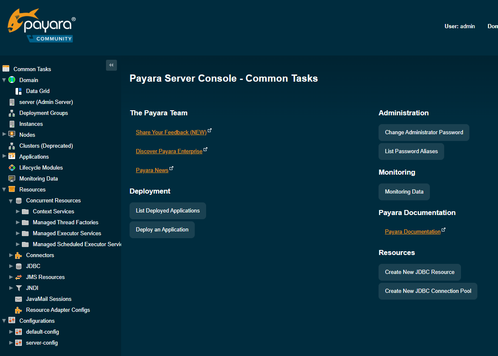

Once selected, you will see the options to create custom Context Service:

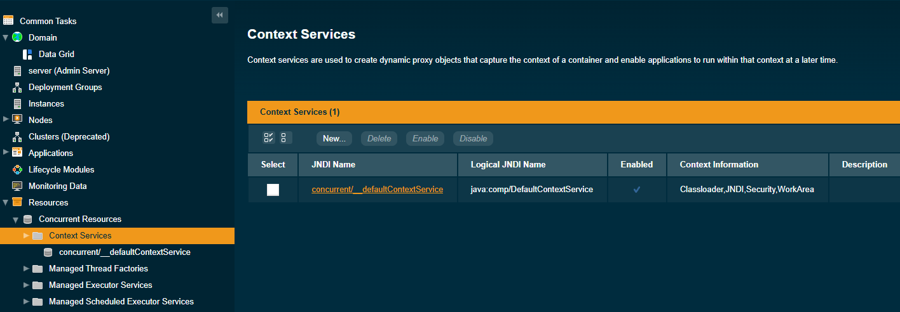

Click in option New and add the following name: concurrent/ContextFromConsole

Finally, click ok to save the new resource

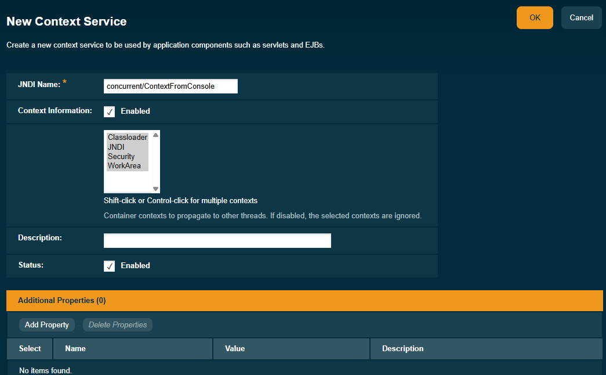

Click on save, and that's it, new resource saves it. You can do the same action by using the following command

```shell
asadmin create-context-service concurrent/Context1
```

To verify from command the available resource use the following:

```shell
asadmin list-context-services
```
to update the resource you need first to get to see which properties to change with the following command:

```shell
asadmin get resources.context-service.concurrent/Context1.*
```

then you can set a new value for one of them:

```shell
asadmin set resources.context-service.concurrent/Context1.deployment-order=120
```

if you need to delete the resource, you can do by the following command:

```shell
asadmin delete-context-service concurrent/Context1
```

Last but not least, we can create the resource using annotations, here the example:

```java
        @ContextServiceDefinition(
        name = "java:comp/concurrent/MyExecutorContext",
        propagated = { SECURITY, APPLICATION })
        @Path("/concurrency")
        public class ConcurrencyResource {
            ..... 
            .....
        }
```
This annotation can be applied to a type, and with this the resource can be used to define other resources or can be injected as follows:

```java
        @Resource(lookup = "java:comp/concurrent/MyExecutorContext")
        private ContextService contextService;
```

As you can see, it is easy to interact with the three modes with the resources. Finally, if you need to use in your code the new resource you need to inject and locate with specific JNDI name as follows:

```java
    @Resource(name = "concurrent/ContextFromConsole")
    private ContextService contextService;
```

that is enough to inject the resource and use your code.

##### Managed Thread Factories, Managed Executor Service and Scheduled Executor Services

As we saw with ContextService, we can do the same for the other categories of the resources. Open the option you need from the console and create the resource. The recommendation is to use a name corresponding to the resource to easily identify:

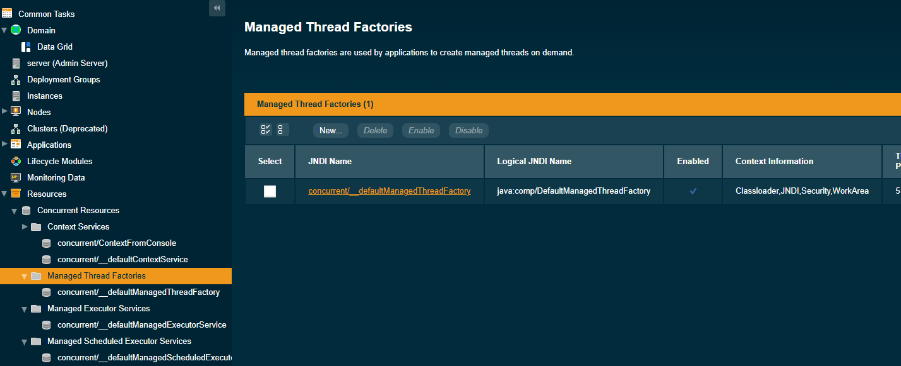

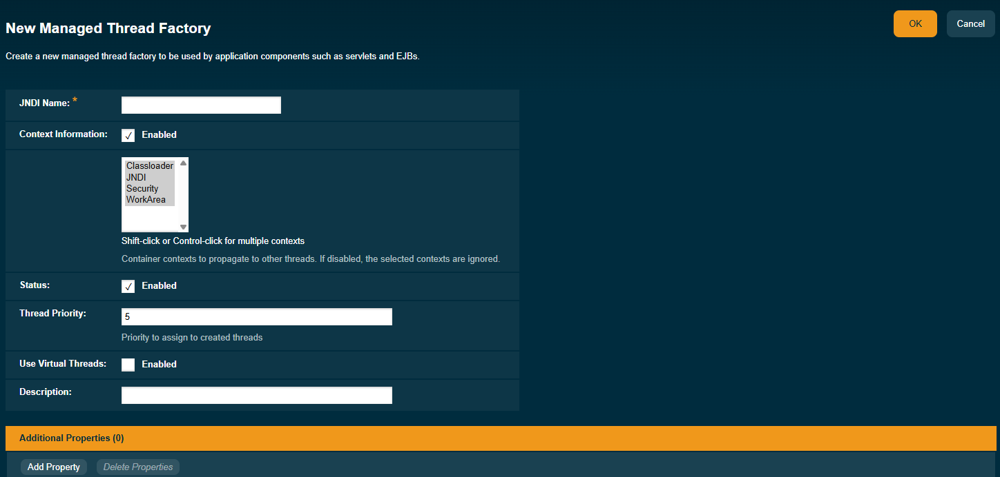

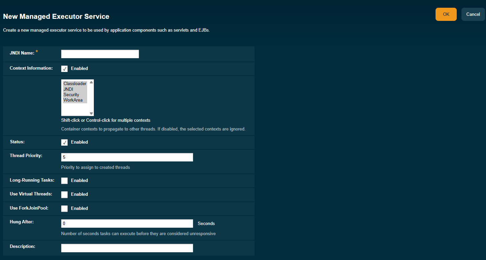

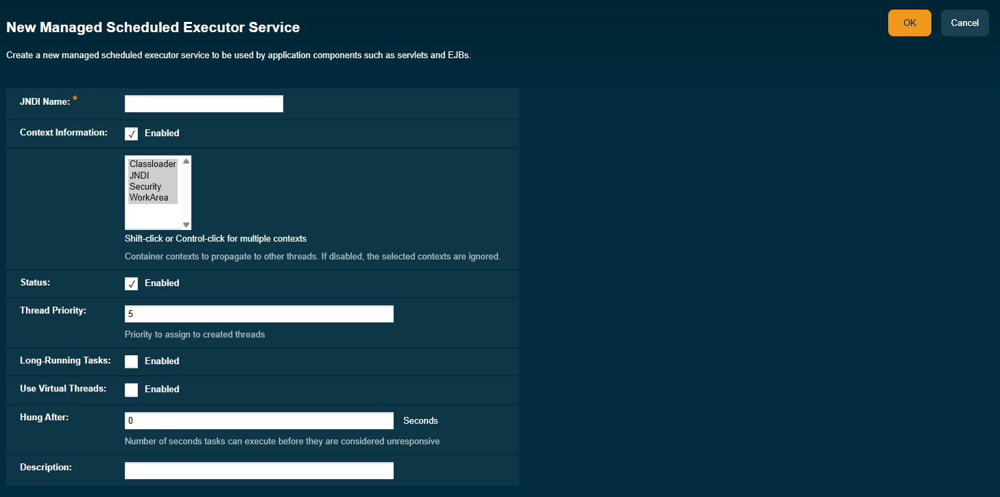

To summary the commands to interact, I have the following table:

Managed Thread Factory commands:

| Command | Action                                                                   |
| ------- |--------------------------------------------------------------------------|
|asadmin> create-managed-thread-factory concurrent/Factory1     | Creates a new Managed Thread Factory Resource                            |
|asadmin> list-managed-thread-factories| List the available Managed Thread Factories                              |
|asdmin> get resources.managed-thread-factory.{resource-JNDI-name}.*| Get the Managed Thread Factory properties from the specified JNDI name   |
|asdmin> set resources.managed-thread-factory.{resource-JNDI-name}.deployment-order=120| Set the specified property to the Managed Thread Factory using JNDI name |
|asadmin> delete-managed-thread-factory concurrent/Factory1| Deletes the specified Managed Thread Factory with the JNDI name          |

And the annotation to create the resource as follows:

````java
        @ManagedThreadFactoryDefinition(
        name = "java:comp/concurrent/MyThreadFactory",
        context = "java:comp/concurrent/MyExecutorContext",
        priority = 4)
        @Path("/concurrency")
        public class ConcurrencyResource {
            .....
            .....
        }
````

to inject use the name on the resource annotation:

````java
        @Resource(lookup = "java:comp/concurrent/MyThreadFactory")
        private ManagedThreadFactory managedThreadFactory;
````

If you need to check the API documentation, go to the following link: [ManagedThreadFactoryDefinition](https://jakarta.ee/specifications/platform/11/apidocs/jakarta/enterprise/concurrent/managedthreadfactorydefinition)


Managed Executor Services commands:

| Command | Action                                                                   |
| ------- |--------------------------------------------------------------------------|
|asadmin> create-managed-executor-service concurrent/Executor1     | Creates a new Managed Executor Service Resource                          |
|asadmin> list-managed-executor-services| List the available Managed Executor Services                             |
|asdmin> get resources.managed-executor-service.{resource-JNDI-name}.*| Get the Managed Executor Service properties from the specified JNDI name |
|asdmin>  set resources.managed-executor-service.{resource-JNDI-name}.deployment-order=120| Set the specified property to the Managed Executor Service using JNDI name |
|asadmin> delete-managed-executor-service concurrent/Executor1| Deletes the specified Managed Executor Service with the JNDI name          |

And the annotation to create the resource as follows:

````java
        @ManagedExecutorDefinition(
        name = "java:comp/concurrent/MyExecutor",
        context = "java:comp/concurrent/MyExecutorContext",
        hungTaskThreshold = 120000,
        maxAsync = 5)
        @Path("/concurrency")
        public class ConcurrencyResource {
            .....
            .....
        }
````

to inject use the name on the resource annotation:

````java
        @Resource(lookup = "java:comp/concurrent/MyExecutor")
        private ManagedExecutorService managedExecutorService;
````

If you need to check the API documentation, go to the following link: [ManagedExecutorDefinition](https://jakarta.ee/specifications/platform/11/apidocs/jakarta/enterprise/concurrent/managedexecutordefinition)

Managed Scheduled Executor Services:

| Command | Action                                                                             |
| ------- |------------------------------------------------------------------------------------|
|asadmin> create-managed-scheduled-executor-service concurrent/ScheduledExecutor1    | Creates a new Managed Scheduled Executor Service Resource                          |
|asadmin> list-managed-scheduled-executor-services| List the available Managed Scheduled Executor Service                              |
|asdmin>get resources.managed-scheduled-executor-service.{resource-JNDI-name}.*| Get the Managed Scheduled Executor Service properties from the specified JNDI name |
|asdmin> set resources.managed-scheduled-executor-service.{resource-JNDI-name}.deployment-order=120| Set the specified property to the Managed Scheduled Executor Service using JNDI name         |
|asadmin> delete-managed-scheduled-executor-service concurrent/ScheduledExecutor1| Deletes the specified Managed Scheduled Executor Service with the JNDI name                  |

And the annotation to create the resource as follows:

````java
        @ManagedScheduledExecutorDefinition(
        name = "java:comp/concurrent/MyScheduledExecutor",
        context = "java:comp/concurrent/MyExecutorContext",
        hungTaskThreshold = 30000,
        maxAsync = 3)
        @Path("/concurrency")
        public class ConcurrencyResource {
            .....
            .....
        }
````

to inject use the name on the resource annotation:

````java
        @Resource(lookup = "java:comp/concurrent/MyScheduledExecutor")
        private ManagedScheduledExecutorService managedScheduledExecutorService;
````

If you need to check the API documentation, go to the following link:[ManagedScheduledExecutorDefinition](https://jakarta.ee/specifications/platform/11/apidocs/jakarta/enterprise/concurrent/managedscheduledexecutordefinition)

In case you execute the command to create the resource, use the following to inject each of them:

```java
    @Resource(name = "concurrent/Factory1")
    private ManagedThreadFactory managedThreadFactory1;
```

```java
    @Resource(name = "concurrent/Executor1")
    private ManagedExecutorService managedExecutorService1;
```

```java
    @Resource(name = "concurrent/ScheduledExecutor1")
    private ManagedScheduledExecutorService managedScheduledExecutorService1;
```


-----
#### **Task**

Choose an option from the previous section to generate your custom resources and provide into your application.

-----

#### What is Virtual Threads?

A Java Virtual Thread is a lightweight, user-mode thread introduced in Java 21 as part of Project Loom. Unlike traditional platform threads (which are OS threads), virtual threads are managed by the Java Virtual Machine (JVM) and do not map directly to operating system threads. This allows for a much larger number of concurrent tasks with significantly less overhead.

[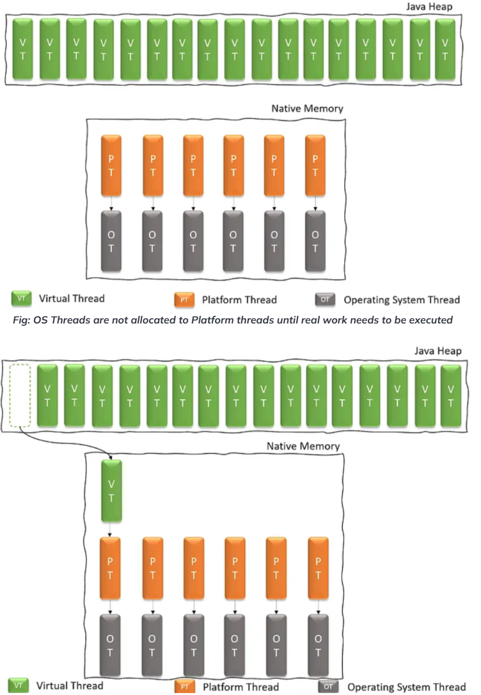](https://blog.nashtechglobal.com/virtual-threads-the-future-of-java-threading/)

- Lightweight: The Virtual Thread consumes little memory per thread, typically a few hundred bytes, compared to megabytes for platform threads. This enables applications to handle millions of concurrent tasks.
- Managed by JVM: The JVM now handles the scheduling and lifecycle of virtual threads. It can efficiently park (suspend) and unpark (resume) virtual threads without involving the OS.
- Non-blocking I/O: When a virtual thread performs a blocking I/O operation (like reading from a network socket), the JVM parks the virtual thread and allows its underlying platform thread to execute other virtual threads. Once the I/O operation completes, the virtual thread is unparked and resumes execution. This avoids thread starvation and improves resource utilization.
- Easy to Use:  Developers can use virtual threads with the same java.lang.Thread API they are already familiar with, making adoption straightforward. You create them using Thread.startVirtualThread() or Executors.newVirtualThreadPerTaskExecutor().
- Structured Concurrency: Virtual threads work well with the concept of structured concurrency, which promotes more readable and maintainable concurrent code by treating concurrent tasks as a single unit of work.
- Improved Throughput: By drastically reducing the overhead of context switching and allowing more tasks to be active concurrently, virtual threads can significantly improve the throughput of I/O-bound applications.

#### How to use with Jakarta 11?

As you can see when interacting with the Admin console and when working to create custom concurrent resources. We saw an option to enable virtual threads. By marking that option, you are telling to the Payara Server to enable Virtual Threads for each of the custom resources like: ManagedThreadFactory, ManagedExecutorService and ManagedScheduledExecutorService.


Another option we can use to make this is with commands. The following commands show you how you can enable virtual threads with commands:

```java
asadmin> create-managed-executor-service --usevirtualthreads concurrent/Executor1
```
You can use the new option --uservirtualthreads for the commands: create-managed-executor-service, create-managed-scheduled-executor-service and create-managed-thread-factory to indicate that the resource will use that functionality, remember that this depends on your runtime JDK. If you don't use JDK 21, this option only generates normal threads, without affecting the system.

If you want to change an available resource, use the get and set option to set the virtual threads enabled. Check the following commands:

```java
asdmin> get resources.managed-executor-service.concurrent/Executor1.*
```
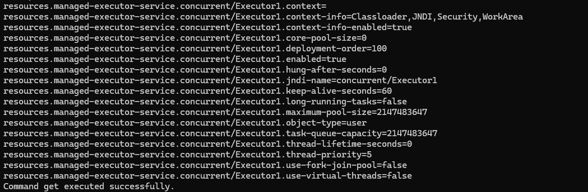

now change the property with the following command:

```java
asdmin>  set resources.managed-executor-service.concurrent/Executor1.use-virtual-threads=true
```
check again properties to see the reflected change:

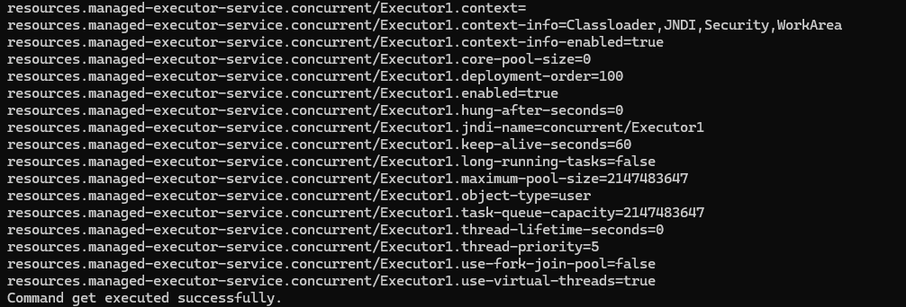

-----
#### **Task**
Now it is time to experiment. The following task is to enable for all previous concurrent resources the capability for virtual threads. Remember that this property only applies to the following resources: ManagedThreadFactory, ManagedExecutorService and ManagedScheduledExecutorService. Enable the property using any of the available modes and run the examples with it.

-----

