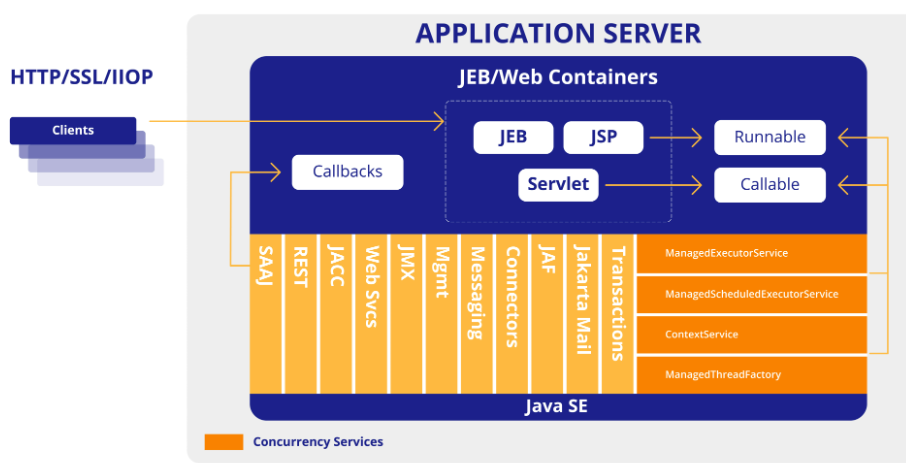
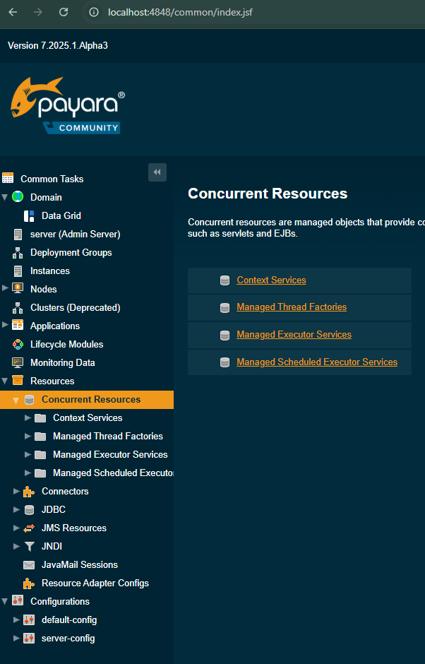
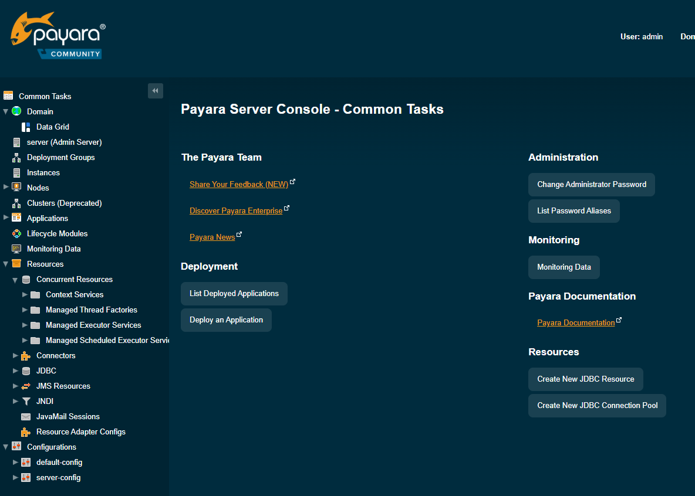
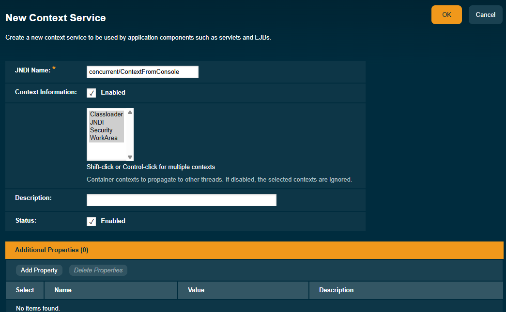
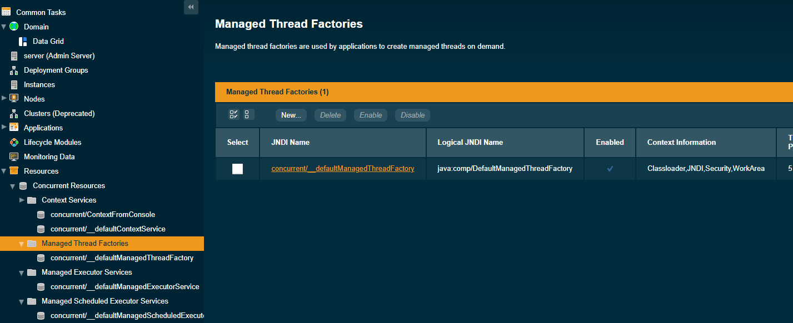
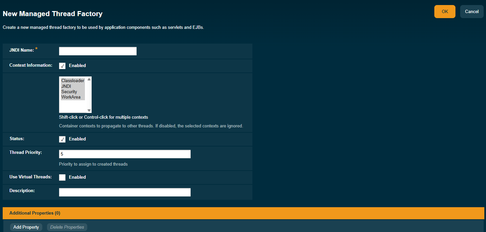
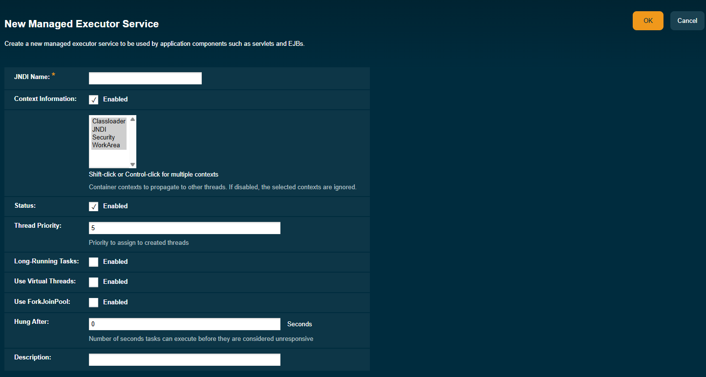
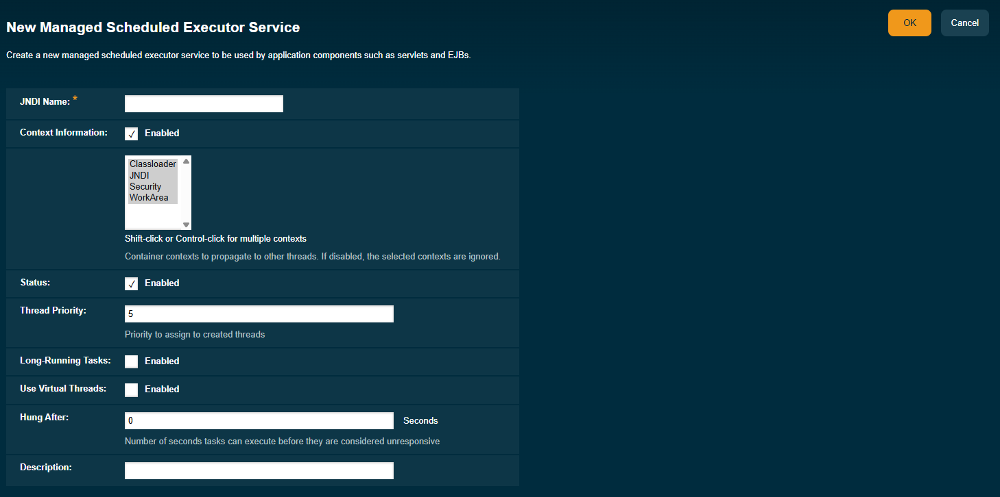
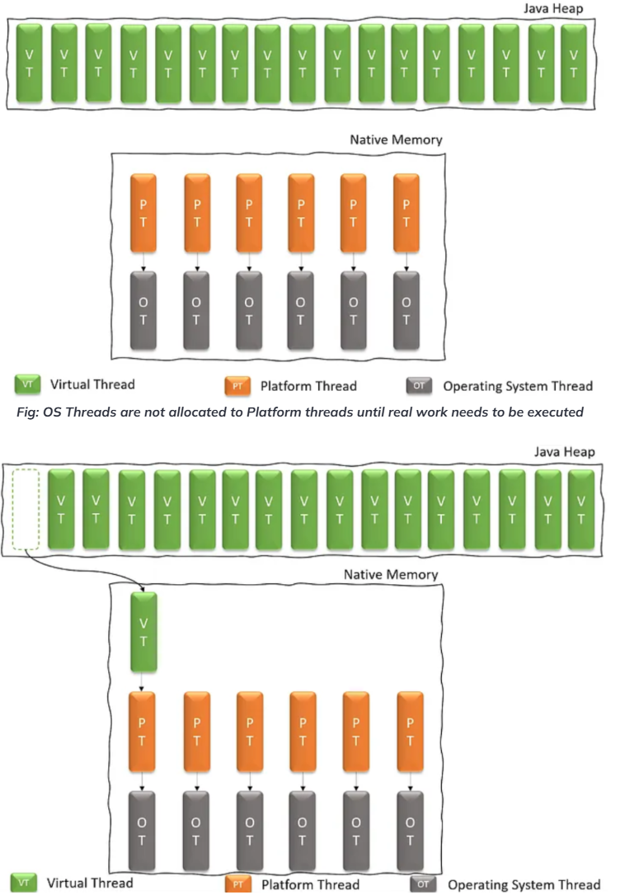
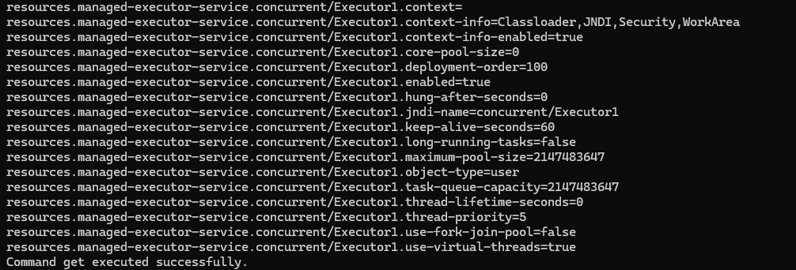

# Jakarta 11 with Payara 7 WorkShop

## Participante

### **Módulo 6: Concurrencia.**

#### Concurrencia de Jakarta

La especificación Jakarta Concurrency es parte del conjunto de la especificación Jakarta 11, y su enfoque principal es el desarrollo de un **marco estándar para gestionar y usar la programación concurrente** dentro de las aplicaciones empresariales. Esta especificación se encarga de los desafíos del multihilo en un entorno gestionado, asegurando que las operaciones concurrentes no comprometan la integridad del servidor de aplicaciones o el contenedor.

Por ello, **no se recomienda usar construcciones de hilos nativos**, ya que esto comprometería el entorno gestionado. Esto significa que no podemos usar directamente las API de concurrencia de Java SE como `java.lang.Thread` o `java.util.Timer`.

La implementación base de esta especificación proporciona una versión gestionada de las interfaces conocidas de `java.util.concurrent.ExecutorService`. Para ello tenemos lo siguiente:



- **ManagedExecutorService**: Similar a `java.util.concurrent.ExecutorService`, se utiliza para enviar tareas asíncronas para su ejecución en un **grupo de hilos gestionado**. Es ideal para descargar operaciones de larga duración del hilo de solicitud principal.
- **ManagedScheduledExecutorService**: Extiende `ManagedExecutorService` para programar tareas para que se ejecuten en un momento específico o repetidamente.
- **ContextService**: Facilita la captura y propagación de información contextual (como contexto de seguridad, contexto de cargador de clases, contexto de CDI) a través de diferentes hilos. Esto es vital para evitar problemas cuando una tarea se ejecuta en un hilo diferente al que la inició.
- **ManagedThreadFactory**: Permite la creación de hilos que heredan el contexto del componente que los creó, asegurando que la seguridad adecuada y otros contextos se propaguen.

#### Beneficios de usar la especificación

Al agregar la implementación de esto, obtenemos muchos beneficios, algunos de ellos son los siguientes:

- **Menos código repetitivo y complejidad**: Con esta capa de servicios gestionados, ahora es sencillo de usar e implementar en nuestro día a día, inyecta los recursos cuando los necesites y úsalos en tus componentes específicos.
- **Compatibilidad con la concurrencia de Java SE**: Como dijimos, esta especificación se basa en la implementación de Java SE, proporcionando las adiciones más recientes para la concurrencia. Veremos cómo usar los hilos virtuales más adelante.
- **Rendimiento y capacidad de respuesta mejorados**: Al descargar tareas de larga duración a hilos en segundo plano, las aplicaciones pueden permanecer receptivas a las interacciones del usuario.
- **Mejor utilización de recursos**: Utiliza eficientemente los núcleos de CPU disponibles ejecutando múltiples tareas concurrentemente.
- **Integridad del contenedor**: Asegura que las operaciones concurrentes respeten el entorno del contenedor y no conduzcan a fugas de recursos o vulnerabilidades de seguridad.
- **Estandarización**: Proporciona una forma estándar e independiente del proveedor para implementar la concurrencia en aplicaciones Jakarta EE, promoviendo la portabilidad.
- **Soporte para características modernas de Java**: Las versiones más recientes de Jakarta Concurrency (como 3.1 en Jakarta EE 11) están incorporando soporte para características modernas de Java como los Hilos Virtuales, mejorando aún más la escalabilidad y el rendimiento.

#### ¿Cómo usarlo?

Payara proporciona recursos predeterminados y la capacidad de definir nuevos según las necesidades para revisar los servicios disponibles para la concurrencia, ve a la siguiente URL: [Payara Home](http://localhost:4848/common/index.jsf)


Ve a la sección **Resources** en el menú lateral izquierdo y selecciona **Concurrent Resources**, expande la opción y verás las opciones disponibles:



Ahora es el momento de crear una implementación sencilla usando nuestros servicios de concurrencia gestionados.

#### Usar recursos predeterminados

Comencemos con **ManagedExecutorService**. Esto nos ayudará a ejecutar tareas asíncronamente, y el contexto del contenedor se propaga al hilo que ejecuta la tarea. Para usarlo, necesitas inyectar el recurso en tu componente así:

```java
    @Resource
    private ManagedExecutorService managedExecutorService;
```

-----
**NOTA:**

Para Concurrencia 3.1, ahora puedes usar la anotación `@Inject` para inyectar los recursos.

-----

Entonces podemos usar ese ejecutor para enviar el trabajo a nuevos hilos, mira el siguiente ejemplo:

```java
    @Inject
    private ManagedExecutorService managedExecutorService;

    @GET
    @Path("managedExecutorService")
    @Produces(MediaType.TEXT_PLAIN)
    public String getManagedExecutorService() throws ExecutionException, InterruptedException {
        AtomicInteger numberExecution1 = new AtomicInteger(0);
        AtomicInteger numberExecution2 = new AtomicInteger(0);
        Future future1 = managedExecutorService.submit(() -> {
            numberExecution1.incrementAndGet();
            System.out.println("Job running" + Thread.currentThread().getName());
        });

        Future future2 = managedExecutorService.submit(() -> {
            numberExecution2.incrementAndGet();
            System.out.println("Job running" + Thread.currentThread().getName());
        });

        future1.get();
        future2.get();
        System.out.println("Finishing jobs:" + (numberExecution1.get() +"  "+ numberExecution2.get()));
        return "Completed";
    }

```

En este ejemplo, estamos creando dos tareas en hilos diferentes usando el `ManagedExecutorService` para obtener un nuevo número atómico que se imprimirá en la salida.

Ahora necesitamos revisar el **ContextService**, esto nos ayudará a capturar y propagar información contextual (ej. contexto de seguridad, contexto de transacción) desde el hilo donde se envía una tarea al hilo donde se ejecuta.

En el siguiente ejemplo, te mostraré cómo el hilo utilizado por el `ManagedExecutorService` está usando la información contextual para imprimir el nombre del recurso JNDI solicitado. Esto lo proporciona automáticamente el `ContextService` predeterminado del servidor.

```java
    @GET
    @Path("contextService")
    @Produces(MediaType.TEXT_PLAIN)
    public String getContextService() throws ExecutionException, InterruptedException {
        Future<String> future1 = managedExecutorService.submit(() -> {
            try {
                return "getting data from context"+new InitialContext().lookup("java:comp/DefaultDataSource");
            } catch (NamingException e) {
                throw new RuntimeException(e);
            }
        });

        String result = future1.get();

        return "Completed with result " + result ;
    }
```

El siguiente componente es el **ManagedThreadFactory**. Esto proporcionará la capacidad de crear hilos gestionados por el contenedor. Además, el contexto del contenedor se propaga al hilo que ejecuta la tarea. Para usarlo, necesitas inyectar el recurso en tu componente así:

```java
    @Inject
    private ManagedThreadFactory managedThreadFactory;
```

Luego podemos usar el `ManagedThreadFactory` para ejecutar una tarea:

```java
    @GET
    @Path("threadFactory")
    @Produces(MediaType.TEXT_PLAIN)
    public String processWithThreadFactory() throws ExecutionException, InterruptedException {
        Thread t  = managedThreadFactory.newThread(() -> {
            System.out.println("ManagedThread executing");
        });

        t.start();
        return "Completed";
    }
```

Y, el **ManagedScheduledExecutorService**. Esto nos ayudará a definir una tarea para ser ejecutada en tiempos específicos y periódicos. Para usarlo, puedes inyectar el recurso predeterminado del servidor:

```java
    @Inject
    private ManagedScheduledExecutorService managedScheduledExecutorService;
```

Luego podemos usar el `ManagedScheduleExecutorService`. El primer ejemplo muestra cómo enviar una tarea en un momento específico, después de un retraso:

```java
    @GET
    @Path("/scheduleTaskForGivenDelay")
    @Produces(MediaType.TEXT_PLAIN)
    public String processWithScheduledExecutorService() throws ExecutionException, InterruptedException {
        managedScheduledExecutorService.schedule(() -> System.out.println("ScheduledExecutor executing"), 10, TimeUnit.SECONDS);
        return "Scheduled task";
    }

    @GET
    @Path("/scheduleTaskForPeriodicTime")
    @Produces(MediaType.TEXT_PLAIN)
    public String scheduleServiceAllTheTime() throws ExecutionException, InterruptedException {
        managedScheduledExecutorService.scheduleAtFixedRate(() -> System.out.println("ScheduledExecutor with rate"), 3, 1, TimeUnit.SECONDS);
        managedScheduledExecutorService.scheduleWithFixedDelay(() -> System.out.println("ScheduledExecutor with delay"), 2, 2, TimeUnit.SECONDS);
        return "Scheduled task";
    }
```

Los dos ejemplos anteriores muestran cómo puedes crear una tarea para que se inicie en un momento específico, y el segundo endpoint muestra cómo puedes ejecutar una tarea por un tiempo periódico. El método `scheduleAtFixedRate` envía una acción periódica que se habilita primero después del retraso inicial dado, y posteriormente con el período dado; es decir, las ejecuciones comenzarán después de `initialDelay`, luego `initialDelay + period`, luego `initialDelay + 2 * period`, y así sucesivamente. El método `scheduleWithFixedDelay` envía una acción periódica que se habilita primero después del retraso inicial dado, y posteriormente con el retraso dado entre la terminación de una ejecución y el comienzo de la siguiente.

Otras implementaciones que necesitamos mencionar son **ForkAnJoinPool** y la configuración **CronTrigger**. Primero, comencemos con `CronTrigger` como su nombre lo indica, se usa para configurar la notación cron en una clase para ser usada como configuración para ejecutar tareas periódicas. Con el siguiente ejemplo, verás cómo usarlo. Si deseas ver la referencia de la API para comprender los detalles de la notación cron, revisa la siguiente página: [CronTrigger API](https://jakarta.ee/specifications/concurrency/3.1/apidocs/jakarta.concurrency/jakarta/enterprise/concurrent/crontrigger)

Para usar esta configuración de `CronTrigger` necesitas combinarla con `ManagedScheduleExecutorService`, aquí el ejemplo:

```java
    @Inject
    ManagedScheduledExecutorService managedScheduledExecutorService;
```

Luego puedes usar la interfaz `Trigger` para guardar la referencia del objeto `CronTrigger` que se usará con él `ManagedScheduleExecutorService` en el método `schedule`. Aquí el ejemplo:

```java
    @GET
    @Path("cronTrigger")
    @Produces(MediaType.TEXT_PLAIN)
    public String getText() throws InterruptedException {
        AtomicInteger numberExecution = new AtomicInteger();
        ZoneId santDomingo = ZoneId.of("America/America/Santo_Domingo");
        Trigger trigger = new CronTrigger("* * * * * *", santDomingo);
        ScheduledFuture feature = managedScheduledExecutorService.schedule(() -> {
            numberExecution.getAndIncrement();
            System.out.println("Cron Trigger running");
        }, trigger);
        Thread.sleep(10000);
        feature.cancel(true);
        return "CronTrigger Submitted:"+numberExecution.get();
    }
```

Del ejemplo anterior, podemos ver que configuramos un `CronTrigger` para que se ejecute cada segundo y la tarea usará el trigger como configuración. La tarea incrementará un número e imprimirá un mensaje. Luego controlamos la ejecución con un retraso de 10,000 milisegundos para permitir que la tarea funcione e imprima e incremente el número 10 veces. Una vez finalizado, podemos obtener el número incrementado con un valor de 10.

Ahora es el momento de la implementación de **ForkAndJoinPool**. El `ForkAndJoinPool` es útil cuando tienes una tarea que necesita procesar una gran cantidad de datos, y deseas dividir el trabajo (divide y vencerás) en unidades atómicas para ser procesadas con el número de procesadores disponibles de tu entorno. Esto implica realizar trabajo paralelo y en algún momento unir todos los resultados. Para esto, necesitas implementar un `ForkJoinTask` del tipo `RecursiveAction` sin devolver resultados o `RecursiveTask` para devolver resultados. En el siguiente ejemplo, verás cómo usarlo.

Necesitamos usar `ManagedThreadFactory` para proporcionar a `ForkJoinPool` la fuente de los hilos que serán utilizados por la implementación:

```java
    @Inject
    ManagedThreadFactory managedThreadFactory;
```

Luego podemos declarar el endpoint para llamar a `ForkJoinPool`, de la siguiente manera:

```java
    @GET
    @Path("forkjoin")
    @Produces(MediaType.TEXT_PLAIN)
    public String forkJoinWorkerThreadExecution() throws InterruptedException, ExecutionException {
        final long[] numbers = LongStream.rangeClosed(1, 1_000_000).toArray();
        ForkJoinPool pool = new ForkJoinPool(Runtime.getRuntime().availableProcessors(), managedThreadFactory, null, false);
        ForkJoinTask<Long> task = new ForkJoinSum(numbers);
        ForkJoinTask<Long> total = pool.submit(task);
        Long t = total.get();
        String message = String.format("Counting numbers total:%d", t);
        pool.shutdown();
        return message;
    }
```

Necesitamos la implementación de `ForkJoinSum`, aquí está el código:

```java
    class ForkJoinSum  extends RecursiveTask<Long> {

        public static final long THRESHOLD = 10_000;

        private final long[] numbers;
        private final int start;
        private final int end;

        public ForkJoinSum(long[] numbers) {
            this(numbers, 0, numbers.length);
        }

        private ForkJoinSum(long[] numbers, int start, int end) {
            this.numbers = numbers;
            this.start = start;
            this.end = end;
        }

        @Override
        protected Long compute() {
            System.out.println("thread name:"+Thread.currentThread().getName());
            int length = end - start;
            if (length <= THRESHOLD) {
                return computeSequentially();
            }
            ForkJoinSum leftTask = new ForkJoinSum(numbers, start, start + length / 2);
            leftTask.fork();
            ForkJoinSum rightTask = new ForkJoinSum(numbers, start + length / 2, end);
            Long rightResult = rightTask.compute();
            Long leftResult = leftTask.join();
            return leftResult + rightResult;
        }

        private long computeSequentially() {
            long sum = 0;
            for (int i = start; i < end; i++) {
                sum += numbers[i];
            }
            return sum;
        }
    }
```

Del ejemplo, vemos que se creó un array de un millón de números largos agregados secuencialmente. Luego se crea él `ForkJoinPool` utilizando los procesadores disponibles del sistema, nuestra instancia de `ManagedThreadFactory` y otros dos valores indicados como nulo y falso. Luego necesitamos usar nuestra clase de implementación para la `RecursiveTask` que va a devolver los resultados una vez finalizado. Finalmente, iniciamos la ejecución llamando al método `submit` del pool generado. Para obtener los resultados, llamamos al método `get` para esperar hasta que termine toda la ejecución, después de eso se imprime en la pantalla el resultado.

Continuamos con las nuevas adiciones para **Jakarta Concurrency 3.1**, ahora tenemos la anotación `@Schedule` que puede ejecutar en combinación con la anotación `@Asynchronous` una tarea para un tiempo programado específico usando notación cron o con propiedades personalizadas para el tiempo. Puedes indicar esto en un método de un bean. Luego puedes inyectarlo e iniciar la ejecución en el momento que desees. El siguiente es el ejemplo de la clase con el método para una configuración de `Schedule`:

```java
    @RequestScoped
    public class ScheduledTask {

    @Inject
    private ManagedScheduledExecutorService scheduledExecutorService;

    @Asynchronous(runAt = {
            @Schedule(cron = "*/3 * * * * *")
    })
    public void scheduledTask() {
        System.out.println("Scheduled Task");
    }
}
```

Luego necesitas inyectar el bean en el componente que necesites, donde comenzará la ejecución de la tarea.

```java
    @Inject
    private ScheduledTask scheduledTask;

    @GET
    @Path("asynchronous")
    @Produces(MediaType.TEXT_PLAIN)
    public String getAsynchronousWorkerThreadExecution() throws InterruptedException, ExecutionException {
        scheduledTask.scheduledTask();
        return "asynchronous";
    }
```

Aquí estamos iniciando la ejecución de la tarea programada al llamar al método `scheduledTask()`.

El último tema de esta sección es la adición de una forma personalizada de integrar la información contextual llamada **Contextual Flows (Reactive Streams)**; con esto, la idea es habilitar una forma de usar la información contextual en el contexto de implementaciones reactivas. Si bien crear un ejemplo completo de este tema implicaría mucho esfuerzo, por ahora solo mostramos en el siguiente código cómo podemos lograrlo con la API actual:

```java
@ApplicationScoped
public class ReactiveService {

    @Inject
    private ContextService contextService;

    public Flow.Subscriber<String> createContextualSubscriber(Flow.Subscriber<String> delegate) {
        return contextService.contextualSubscriber(delegate);
    }
}
```

-----

#### **Tarea**

Con toda esta información, ahora es tu turno de experimentar. Por eso, tu trabajo por ahora es copiar cada uno de los ejemplos aquí descritos y usarlos en tu propia implementación. Recuerda que el último tema muestra una implementación parcial de cómo pueden funcionar los Flujos Contextuales, y por eso no es suficiente para ejecutar streams reactivos en este ejemplo.

-----

#### Define tu recurso personalizado

Con Payara, puedes crear tus recursos personalizados usando la Consola de Administración, comandos de administración o con anotaciones. En los siguientes ejemplos, verás cómo hacerlo dentro de Payara Server.

##### Servicio de Contexto

Puedes agregar un recurso personalizado usando la Consola de Administración, comandos de administración o por anotación. Si deseas agregar el recurso personalizado para `ContextService`, entonces debes ir a la opción del Menú ***Resources -\> Concurrent Resources -\> Context Service*** en el lado izquierdo de la página de inicio de Payara Server:



Una vez seleccionado, verás las opciones para crear un `Context Service` personalizado:


Haz clic en la opción **New** y agrega el siguiente nombre: `concurrent/ContextFromConsole`

Finalmente, haz clic en **OK** para guardar el nuevo recurso.



Haz clic en **Save**, y listo, el nuevo recurso está guardado. Puedes realizar la misma acción usando el siguiente comando:

```shell
asadmin create-context-service concurrent/Context1
```

Para verificar desde la línea de comandos el recurso disponible, usa lo siguiente:

```shell
asadmin list-context-services
```

Para actualizar el recurso, primero necesitas ver qué propiedades cambiar con el siguiente comando:

```shell
asadmin get resources.context-service.concurrent/Context1.*
```

Luego puedes establecer un nuevo valor para una de ellas:

```shell
asadmin set resources.context-service.concurrent/Context1.deployment-order=120
```

Si necesitas eliminar el recurso, puedes hacerlo con el siguiente comando:

```shell
asadmin delete-context-service concurrent/Context1
```

Por último, pero no menos importante, podemos crear el recurso usando anotaciones, aquí el ejemplo:

```java
        @ContextServiceDefinition(
        name = "java:comp/concurrent/MyExecutorContext",
        propagated = { SECURITY, APPLICATION })
        @Path("/concurrency")
        public class ConcurrencyResource {
            .....
            .....
        }
```

Esta anotación se puede aplicar a un tipo en este caso la clase del recurso y se puede inyectar de la siguiente manera:

```java
        @Resource(lookup = "java:comp/concurrent/MyExecutorContext")
        private ContextService contextService;
```

Como puedes ver, es fácil interactuar con los tres modos con los recursos. Finalmente, si necesitas usar en tu código el nuevo recurso, debes inyectarlo y localizarlo con un nombre JNDI específico de la siguiente manera:

```java
    @Resource(name = "concurrent/ContextFromConsole")
    private ContextService contextService;
```

Eso es suficiente para inyectar el recurso y usarlo en tu código.

##### Managed Thread Factories, Managed Executor Service y Scheduled Executor Services

Como vimos con `ContextService`, podemos hacer lo mismo para las otras categorías de recursos. Abre la opción que necesites desde la consola y crea el recurso. La recomendación es usar un nombre que corresponda al recurso para identificarlo fácilmente:









Para resumir los comandos para interactuar, tengo la siguiente tabla:

Comandos de Managed Thread Factory:

| Comando | Acción |
|---|---|
|`asadmin> create-managed-thread-factory concurrent/Factory1` | Crea un nuevo recurso Managed Thread Factory |
|`asadmin> list-managed-thread-factories` | Lista las Managed Thread Factories disponibles |
|`asdmin> get resources.managed-thread-factory.{resource-JNDI-name}.*` | Obtiene las propiedades de Managed Thread Factory del nombre JNDI especificado |
|`asdmin> set resources.managed-thread-factory.{resource-JNDI-name}.deployment-order=120` | Establece la propiedad especificada para Managed Thread Factory usando el nombre JNDI |
|`asadmin> delete-managed-thread-factory concurrent/Factory1` | Elimina la Managed Thread Factory especificada con el nombre JNDI |

Y la anotación para crear el recurso de la siguiente manera:

```java
        @ManagedThreadFactoryDefinition(
        name = "java:comp/concurrent/MyThreadFactory",
        context = "java:comp/concurrent/MyExecutorContext",
        priority = 4)
        @Path("/concurrency")
        public class ConcurrencyResource {
            .....
            .....
        }
```

Para inyectar, usa el nombre en la anotación `@Resource`:

```java
        @Resource(lookup = "java:comp/concurrent/MyThreadFactory")
        private ManagedThreadFactory managedThreadFactory;
```

Si necesitas consultar la documentación de la API, ve al siguiente enlace: [ManagedThreadFactoryDefinition](https://jakarta.ee/specifications/platform/11/apidocs/jakarta/enterprise/concurrent/managedthreadfactorydefinition)

Comandos de Managed Executor Services:

| Comando | Acción |
|---|---|
|`asadmin> create-managed-executor-service concurrent/Executor1` | Crea un nuevo recurso Managed Executor Service |
|`asadmin> list-managed-executor-services` | Lista los Managed Executor Services disponibles |
|`asdmin> get resources.managed-executor-service.{resource-JNDI-name}.*` | Obtiene las propiedades de Managed Executor Service del nombre JNDI especificado |
|`asdmin>  set resources.managed-executor-service.{resource-JNDI-name}.deployment-order=120` | Establece la propiedad especificada para Managed Executor Service usando el nombre JNDI |
|`asadmin> delete-managed-executor-service concurrent/Executor1` | Elimina el Managed Executor Service especificado con el nombre JNDI |

Y la anotación para crear el recurso de la siguiente manera:

```java
        @ManagedExecutorDefinition(
        name = "java:comp/concurrent/MyExecutor",
        context = "java:comp/concurrent/MyExecutorContext",
        hungTaskThreshold = 120000,
        maxAsync = 5)
        @Path("/concurrency")
        public class ConcurrencyResource {
            .....
            .....
        }
```

Para inyectar, usa el nombre en la anotación `@Resource`:

```java
        @Resource(lookup = "java:comp/concurrent/MyExecutor")
        private ManagedExecutorService managedExecutorService;
```

Si necesitas consultar la documentación de la API, ve al siguiente enlace: [ManagedExecutorDefinition](https://jakarta.ee/specifications/platform/11/apidocs/jakarta/enterprise/concurrent/managedexecutordefinition)

Managed Scheduled Executor Services:

| Comando | Acción |
|---|---|
|`asadmin> create-managed-scheduled-executor-service concurrent/ScheduledExecutor1` | Crea un nuevo recurso Managed Scheduled Executor Service |
|`asadmin> list-managed-scheduled-executor-services` | Lista los Managed Scheduled Executor Service disponibles |
|`asdmin>get resources.managed-scheduled-executor-service.{resource-JNDI-name}.*` | Obtiene las propiedades de Managed Scheduled Executor Service del nombre JNDI especificado |
|`asdmin> set resources.managed-scheduled-executor-service.{resource-JNDI-name}.deployment-order=120` | Establece la propiedad especificada para Managed Scheduled Executor Service usando el nombre JNDI |
|`asadmin> delete-managed-scheduled-executor-service concurrent/ScheduledExecutor1` | Elimina el Managed Scheduled Executor Service especificado con el nombre JNDI |

Y la anotación para crear el recurso de la siguiente manera:

```java
        @ManagedScheduledExecutorDefinition(
        name = "java:comp/concurrent/MyScheduledExecutor",
        context = "java:comp/concurrent/MyExecutorContext",
        hungTaskThreshold = 30000,
        maxAsync = 3)
        @Path("/concurrency")
        public class ConcurrencyResource {
            .....
            .....
        }
```

Para inyectar, usa el nombre en la anotación `@Resource`:

```java
        @Resource(lookup = "java:comp/concurrent/MyScheduledExecutor")
        private ManagedScheduledExecutorService managedScheduledExecutorService;
```

Si necesitas consultar la documentación de la API, ve al siguiente enlace: [ManagedScheduledExecutorDefinition](https://jakarta.ee/specifications/platform/11/apidocs/jakarta/enterprise/concurrent/managedscheduledexecutordefinition)

En caso de que ejecutes el comando para crear el recurso, usa lo siguiente para inyectar cada uno de ellos:

```java
    @Resource(name = "concurrent/Factory1")
    private ManagedThreadFactory managedThreadFactory1;
```

```java
    @Resource(name = "concurrent/Executor1")
    private ManagedExecutorService managedExecutorService1;
```

```java
    @Resource(name = "concurrent/ScheduledExecutor1")
    private ManagedScheduledExecutorService managedScheduledExecutorService1;
```

-----

#### **Tarea**

Elige una opción de la sección anterior para generar tus recursos personalizados y proporcionarlos en tu aplicación.

-----

#### ¿Qué son los Hilos Virtuales?

Un **Hilo Virtual de Java** es un hilo ligero en modo de usuario introducido en Java 21 como parte del Proyecto Loom. A diferencia de los hilos de plataforma tradicionales (que son hilos del sistema operativo), los hilos virtuales son gestionados por la Máquina Virtual de Java (JVM) y no se mapean directamente a los hilos del sistema operativo. Esto permite un número mucho mayor de tareas concurrentes con una sobrecarga significativamente menor.

[](https://blog.nashtechglobal.com/virtual-threads-the-future-of-java-threading/)

- **Ligeros**: El Hilo Virtual consume poca memoria por hilo, típicamente unos pocos cientos de bytes, en comparación con los megabytes de los hilos de plataforma. Esto permite a las aplicaciones manejar millones de tareas concurrentes.
- **Gestionados por la JVM**: La JVM ahora maneja la programación y el ciclo de vida de los hilos virtuales. Puede estacionar (suspender) y desestacionar (reanudar) eficientemente los hilos virtuales sin involucrar al sistema operativo.
- **E/S no bloqueante**: Cuando un hilo virtual realiza una operación de E/S bloqueante (como leer desde un socket de red), la JVM estaciona el hilo virtual y permite que su hilo de plataforma subyacente ejecute otros hilos virtuales. Una vez que la operación de E/S se completa, el hilo virtual se desestaciona y reanuda la ejecución. Esto evita la inanición de hilos y mejora la utilización de recursos.
- **Fáciles de usar**: Los desarrolladores pueden usar hilos virtuales con la misma API `java.lang.Thread` con la que ya están familiarizados, lo que facilita su adopción. Los creas usando `Thread.startVirtualThread()` o `Executors.newVirtualThreadPerTaskExecutor()`.
- **Concurrencia estructurada**: Los hilos virtuales funcionan bien con el concepto de concurrencia estructurada, que promueve un código concurrente más legible y mantenible al tratar las tareas concurrentes como una única unidad de trabajo.
- **Rendimiento mejorado**: Al reducir drásticamente la sobrecarga del cambio de contexto y permitir que más tareas estén activas concurrentemente, los hilos virtuales pueden mejorar significativamente el rendimiento de las aplicaciones ligadas a E/S.

#### ¿Cómo usarlo con Jakarta 11?

Como puedes ver al interactuar con la consola de administración y al trabajar para crear recursos concurrentes personalizados. Vimos una opción para habilitar los hilos virtuales. Al marcar esa opción, le estás diciendo al Servidor Payara que habilite los Hilos Virtuales para cada uno de los recursos personalizados como: `ManagedThreadFactory`, `ManagedExecutorService` y `ManagedScheduledExecutorService`.


Otra opción que podemos usar para hacer esto es con comandos. Los siguientes comandos te muestran cómo puedes habilitar los hilos virtuales con comandos:

```java
asadmin> create-managed-executor-service --usevirtualthreads concurrent/Executor1
```

Puedes usar la nueva opción `--usevirtualthreads` para los comandos: `create-managed-executor-service`, `create-managed-scheduled-executor-service` y `create-managed-thread-factory` para indicar que el recurso usará esa funcionalidad. Recuerda que esto depende de tu JDK en tiempo de ejecución. Si no usas JDK 21, esta opción solo genera hilos normales, sin afectar el sistema.

Si deseas cambiar un recurso disponible, usa las opciones `get` y `set` para habilitar los hilos virtuales. Revisa los siguientes comandos:

```java
asdmin> get resources.managed-executor-service.concurrent/Executor1.*
```


Ahora cambia la propiedad con el siguiente comando:

```java
asdmin>  set resources.managed-executor-service.concurrent/Executor1.use-virtual-threads=true
```

Vuelve a verificar las propiedades para ver el cambio reflejado:



-----

#### **Tarea**

Ahora es el momento de experimentar. La siguiente tarea es habilitar la capacidad de hilos virtuales para todos los recursos concurrentes anteriores. Recuerda que esta propiedad solo se aplica a los siguientes recursos: `ManagedThreadFactory`, `ManagedExecutorService` y `ManagedScheduledExecutorService`. Habilita la propiedad usando cualquiera de los modos disponibles y ejecuta los ejemplos con ella.

-----